# AWS CLI
* The AWS Command Line Interface (CLI) provides a unified tool to manage your AWS services directly from the command line.
* It allows you to automate AWS tasks, manage resources, and script workflows efficiently.
  
### Install the AWS CLI
* [Refer here](https://docs.aws.amazon.com/cli/latest/userguide/getting-started-install.html) to install AWS CLI in respective OS.
* After install check the version on aws cli
```bash
aws --version
```
### Configure AWS CLI
* To use AWS CLI, You need to provide credentials:
```bash
aws configure
```
* It will prompt for:
    * **Access Key ID**: Found in your AWS Management Console under "My Security Credentials." We can create an user with respective permissions and take the access key and secret access key of that user.
    * **Secret Access Key:** Paired with the Access Key.
    * **Default region:** Example: us-east-1 (Region closest to your users/resources).
    * **Default output format:** Options include json, text, table

### Basic commands
* Check if the cli is connected with your as=ws cloud account.

```bash
aws s3 ls # to list the s3 buckets.
```
* To manage the resources through CLI we can follow the [reference documentation](https://awscli.amazonaws.com/v2/documentation/api/latest/reference/index.html) provided by AWS to write the command.
  
### Task
1. Create VPC using cli
```bash
aws ec2 create-vpc --cidr-block 192.168.0.0/16 --instance-tenancy default
```
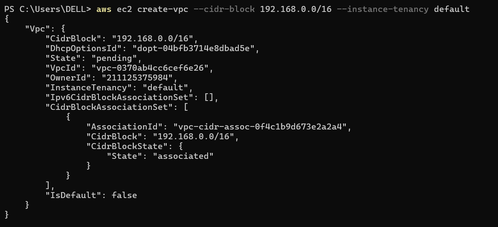
* To add tags to that vpc.
```bash
aws ec2 create-tags --resources "vpc-0370ab4cc6cef6e26" --tags Key=Name,Value=CLI-VPC
``` 


2. create Pub and Pvt subnets
```bash
aws ec2 create-subnet --tag-specifications 'ResourceType=subnet,Tags=[{Key=Name,Value=CLI-Pub-sub}]' --vpc-id vpc-0370ab4cc6cef6e26 --availability-zone us-east-1a --cidr-block 192.168.0.0/24 
aws ec2 create-subnet --tag-specifications 'ResourceType=subnet,Tags=[{Key=Name,Value=CLI-Pvt-sub}]' --vpc-id vpc-0370ab4cc6cef6e26 --availability-zone us-east-1a --cidr-block 192.168.1.0/24 
```
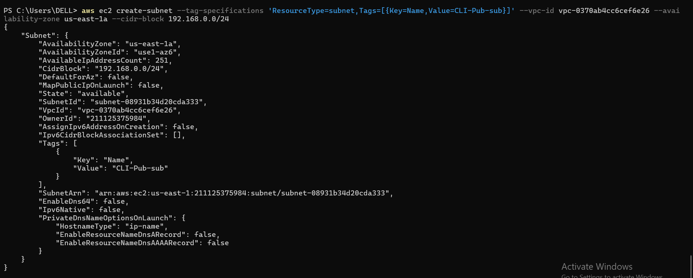

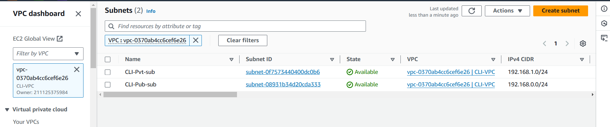

3. create IGW
   
```bash
aws ec2 create-internet-gateway --tag-specification 'ResourceType=internet-gateway,Tags=[{Key=Name,Value=CLI-IGW}]' 
```
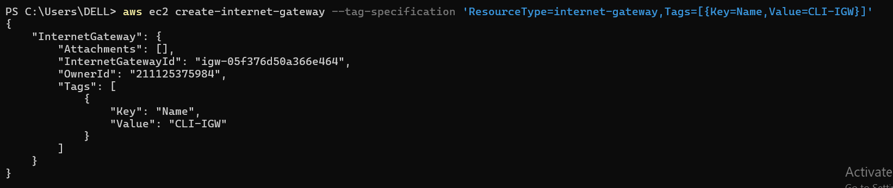
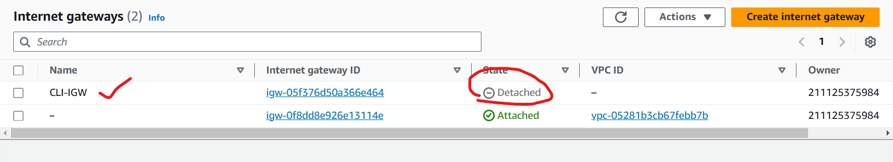

4. Attach IGW to VPC
```bash
aws ec2 attach-internet-gateway --internet-gateway-id igw-05f376d50a366e464 --vpc-id vpc-0370ab4cc6cef6e26
```

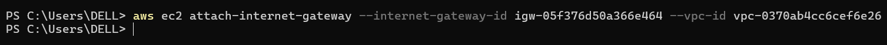
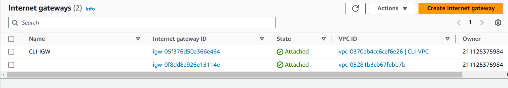

5. Create Pub and PVT RT
   
```bash
aws ec2 create-route-table --tag-specification 'ResourceType=route-table,Tags=[{Key=Name,Value=CLI-pub-rt}]' --vpc-id vpc-0370ab4cc6cef6e26
aws ec2 create-route-table --tag-specification 'ResourceType=route-table,Tags=[{Key=Name,Value=CLI-pvt-rt}]' --vpc-id vpc-0370ab4cc6cef6e26
```
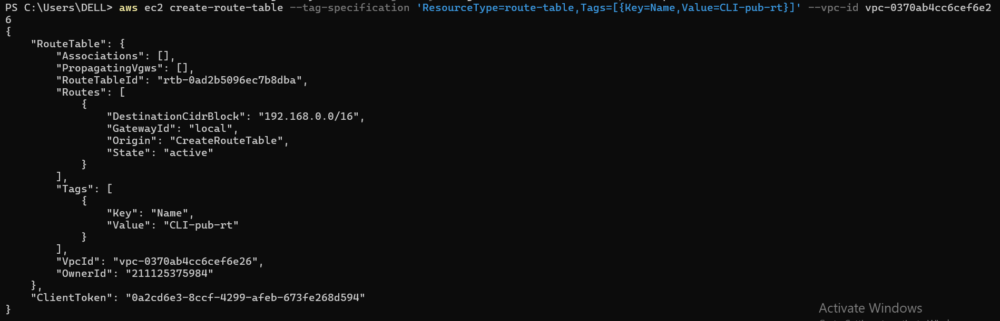
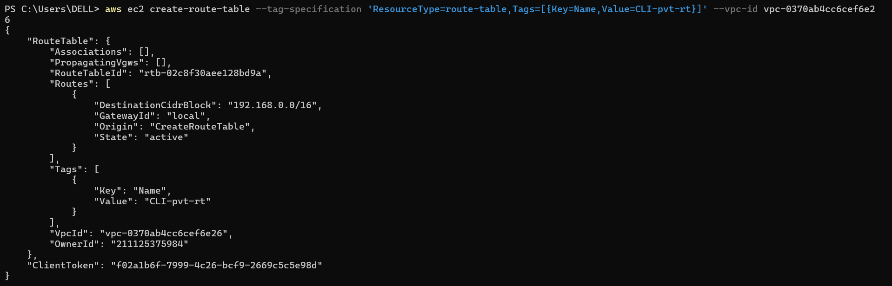
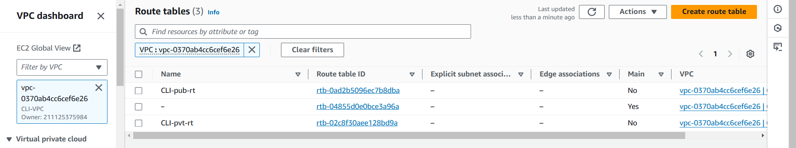

6. Attach Pub sub to Pub rt and Attach Pvt Sub to Pvt rt
```bash
aws ec2 associate-route-table --route-table-id rtb-0ad2b5096ec7b8dba --subnet-id subnet-08931b34d20cda333
aws ec2 associate-route-table --route-table-id rtb-02c8f30aee128bd9a --subnet-id subnet-0f7573440400dc0b6
```
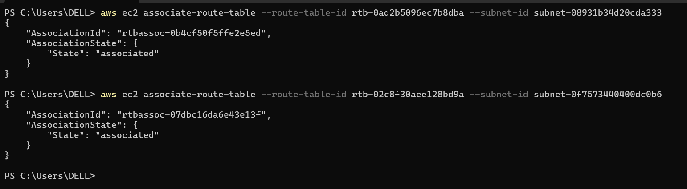
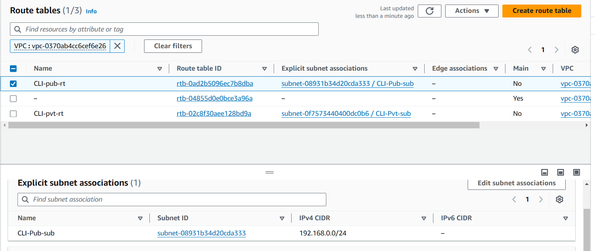
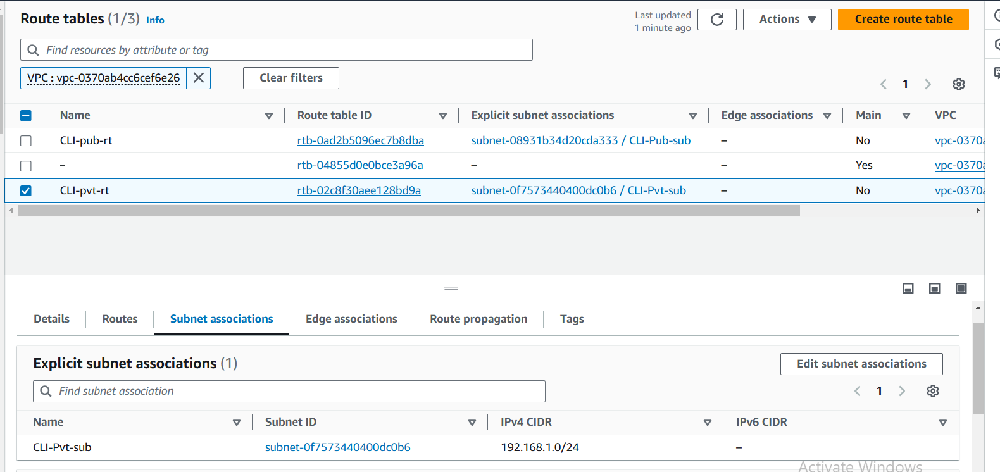

7. Attach IGW to Pub RT
```bash
aws ec2 create-route --route-table-id rtb-0ad2b5096ec7b8dba --destination-cidr-block 0.0.0.0/0 --gateway-id igw-05f376d50a366e464
```
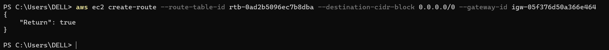
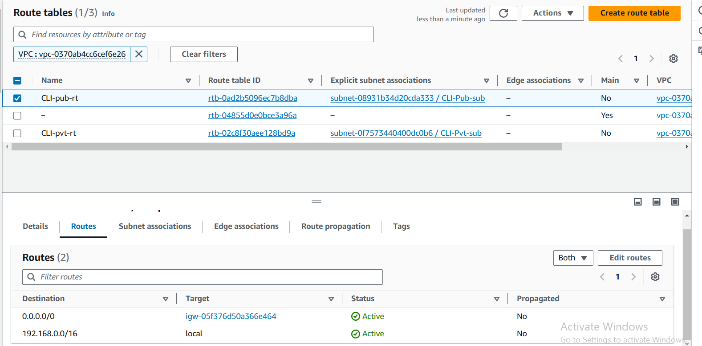

8. Create Sg for ssh // http
```bash
aws ec2 create-security-group --description "allow ssh&http" --group-name ssh --vpc-id vpc-0370ab4cc6cef6e26 --tag-specifications 'ResourceType=security-group,Tags=[{Key=Name,Value=CLI-sg}]'
```
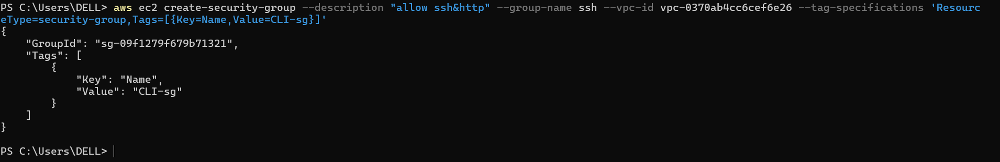
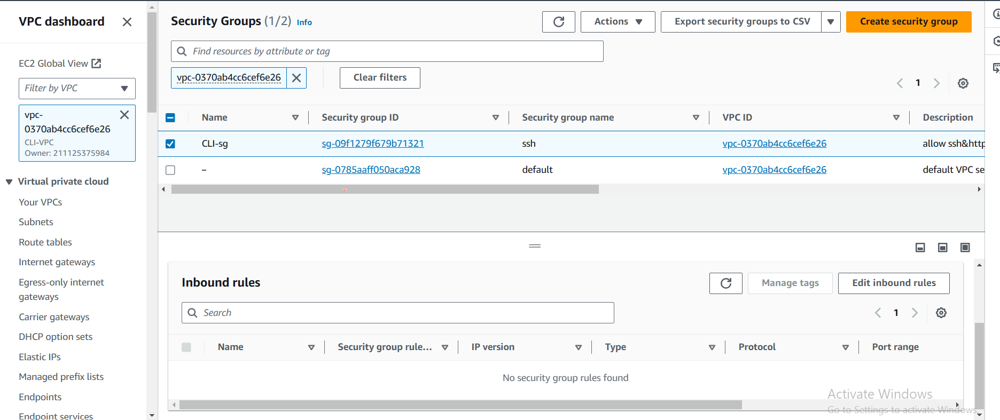

9. Create a security rule for the security group
```bash
aws ec2 authorize-security-group-ingress  --group-id sg-09f1279f679b71321 --protocol tcp --port 22 --cidr 0.0.0.0/0
aws ec2 authorize-security-group-ingress  --group-id sg-09f1279f679b71321 --protocol http --port 80 --cidr 0.0.0.0/0
```
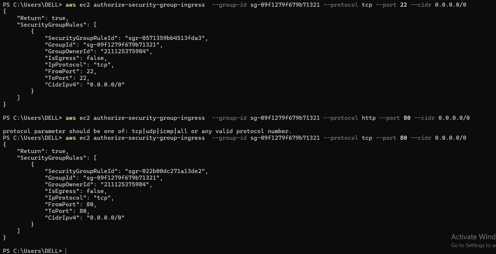
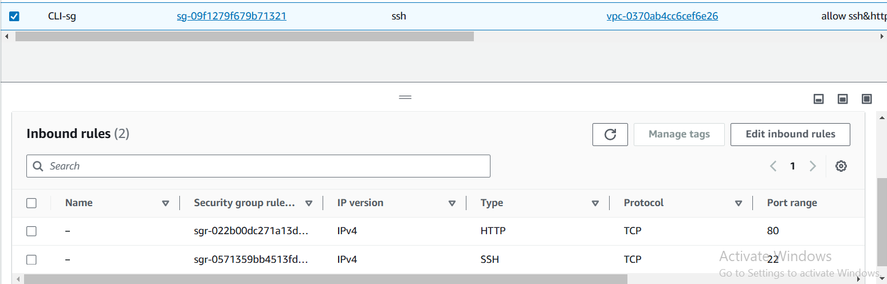

10. Create keypair
```bash
aws ec2 create-key-pair --key-name cli-key --key-type rsa --tag-specifications 'ResourceType=key-pair,Tags=[{Key=Name,Value=CLI-key}]' --key-format pem 
```

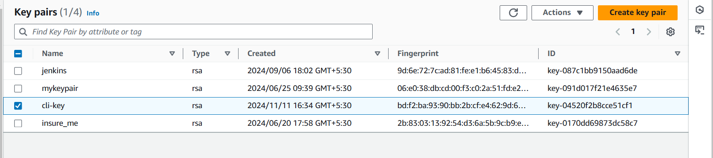

11. Create a Ec2 in Pub Sub
```bash
aws ec2 run-instances --image-id ami-063d43db0594b521b --instance-type t2.micro --key-name cli-key --subnet-id subnet-08931b34d20cda333 --security-group-ids "sg-09f1279f679b71321" --tag-specifications 'ResourceType=instance,Tags=[{Key=Name,Value=CLI-pub-instance}]' --associate-public-ip-address
```
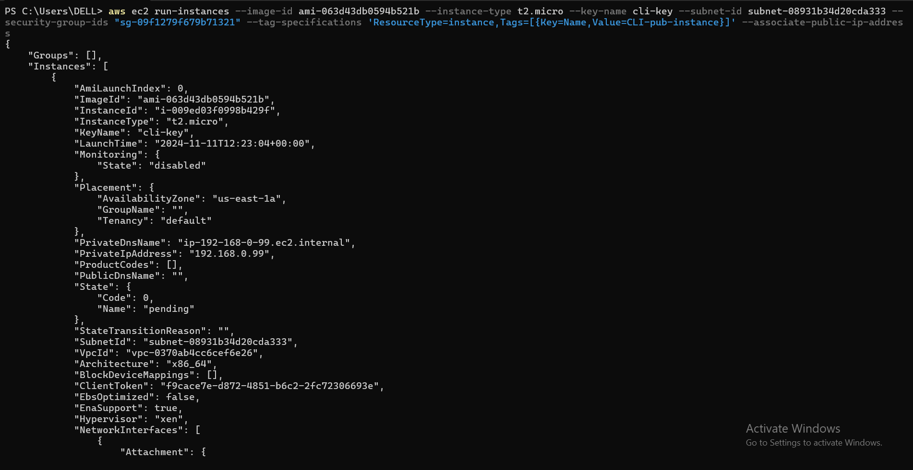
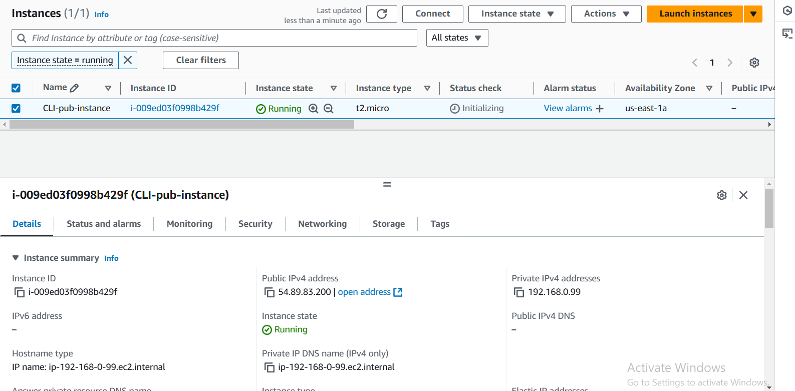

12. Create a Ec2 in Pvt Sub 

```bash
aws ec2 run-instances --image-id ami-063d43db0594b521b --instance-type t2.micro --key-name cli-key --subnet-id subnet-0f7573440400dc0b6 --security-group-ids "sg-09f1279f679b71321" --tag-specifications 'ResourceType=instance,Tags=[{Key=Name,Value=CLI-pvt-instance}]'
```
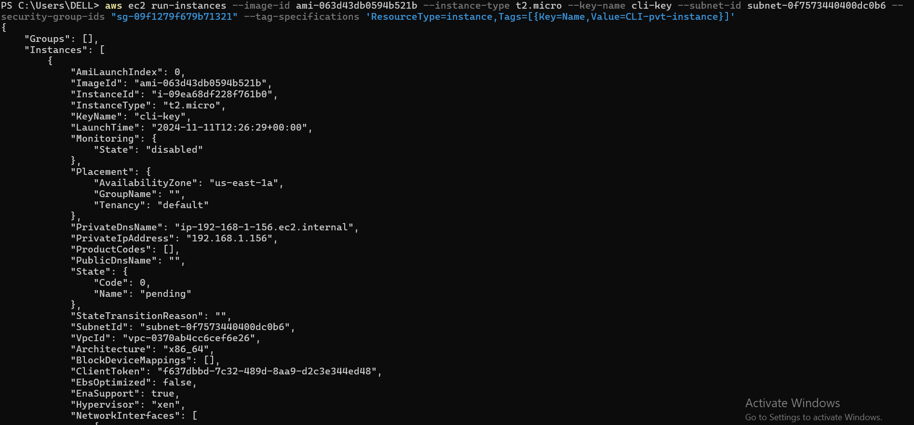
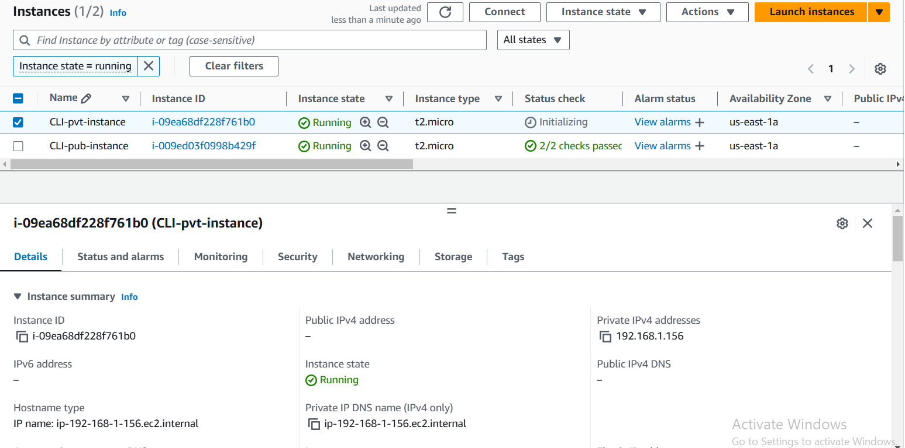
