# Elastic File System(EFS)
* EBS is a instane specific volume.
* If we have 100s of servers across region, EBS is ot the correct choice.
* We have a Network specific volume know as **`EFS`**
* EPS's technology is similar to NPS(Networl file system)
* EPS is not specific to an Availability zone it is a Network specific.
* We can't connect EFS of one network to a server in other network.

### What is AWS Elastic File System?
* EFS falls under the file storage category, EFS is a file level, Fully managed, storage provided by AWS that can be accessed by multiple EC2 instances concurrently in a network.
* EFS is specially designed for high throughput and low latency application.
* EFS is scalable, elastic, cloud-native NFS filesystem.
* EFS or NFS works on a particular port which is **`2049`**
* EFS has no minimium fees, you pay only for the storage that you use, the data that you read and write any aditional throughput that you provision.

#### Usecases of EFS:
1. Secure file sharing
2. Web hosting
3. Modernize application development
4. Machine learning and AI workloads.

### Network File System(NFS):
* NFS is a network protocol for distributed file sharing.
* Imagine there are servers in one network and one of the server is converted to NFS.
* All the data stored in remaining servers will directly stored to NFS server.
* When a new server is created in that network that server data can also access the pervious data.
* Before cloud was introduced, Organizations follow this process.

### Labs:
* Launch two instances in 2 different Availability zones.
  
  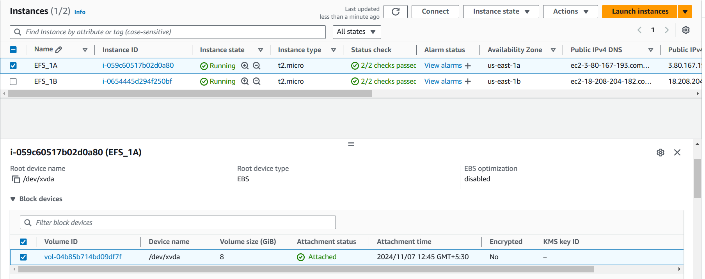

* Create an EFS.
    * search EFS --> EFS console --> Create file system
  

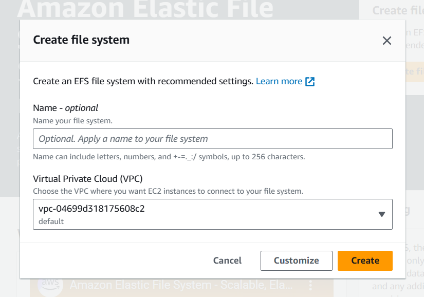
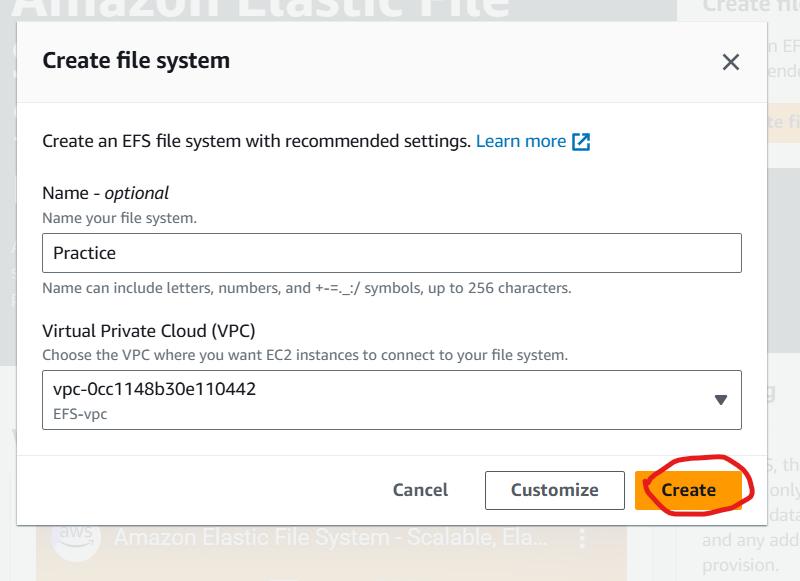
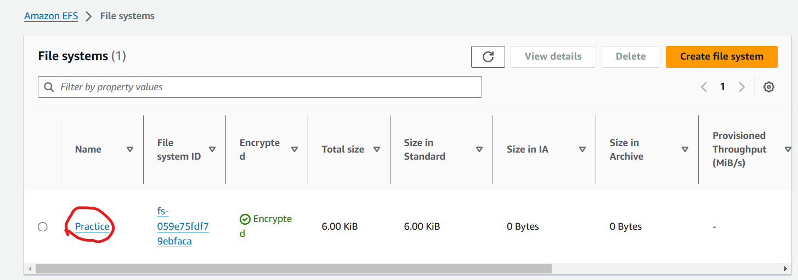

* Select the EFS you have created.
  
  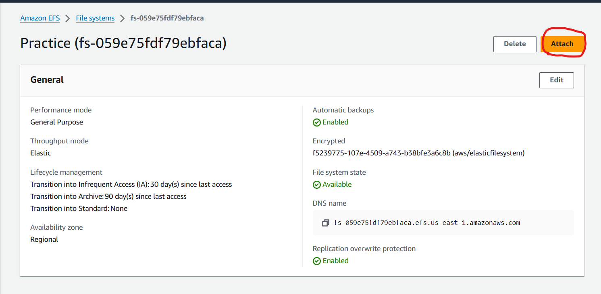

* We have two options to mount. 
    1. Mount via DNS
    2. Mount via IP

  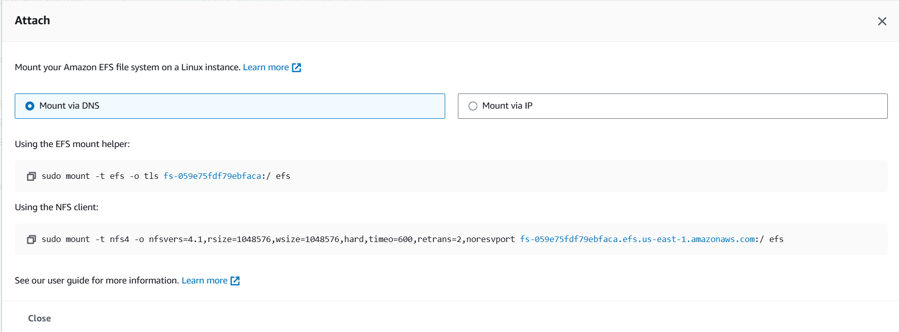

* In mount via ip, ip address changes according to the availability zone.
  
  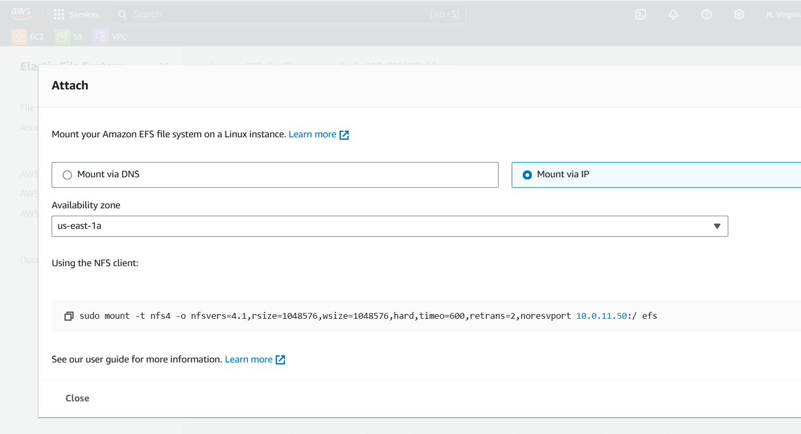
  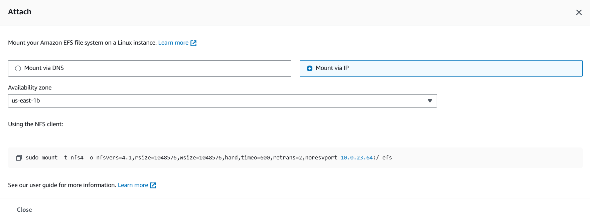

* Now to mount the file system to servers copy the command and run on one of the sercers.
  
  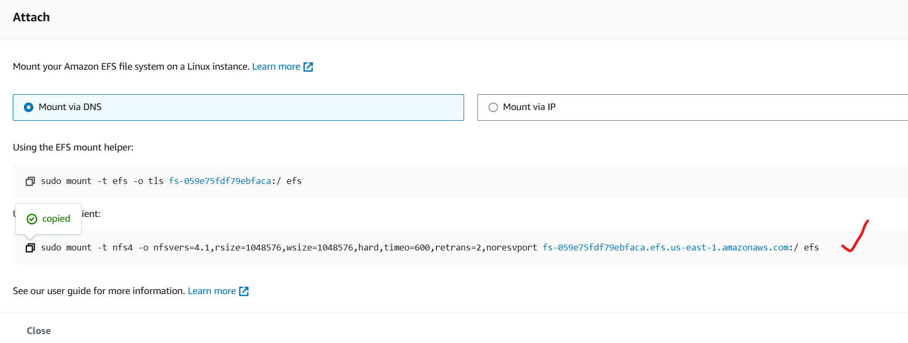
  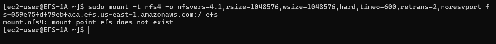

 * In above image /efs folder is not present in the server. We can give any name instead of efs.
  
  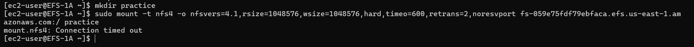

* While EC2 is trying to connect with EFS it will fail because EFS is network level which will use port for comminication.
* We have to allow the port in security group to allow communication.
  
  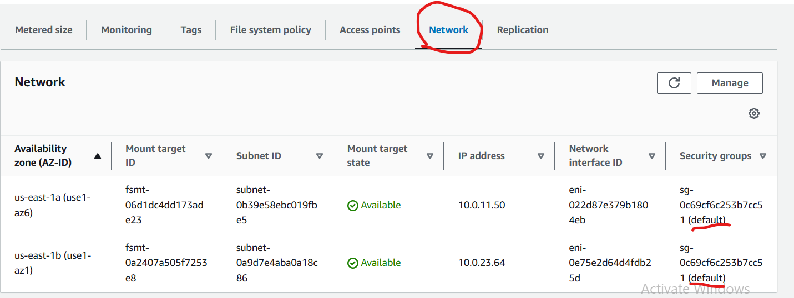

* Go to VPC --> Security groups --> create new security group.
  
  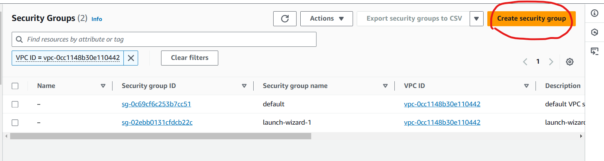

* Now go to EFS and change the default security group to newly created security group.
* This sg has to be attached to EFS not EC2
* Now try to mount EFS in EC2  and check if mounted or not.
  
  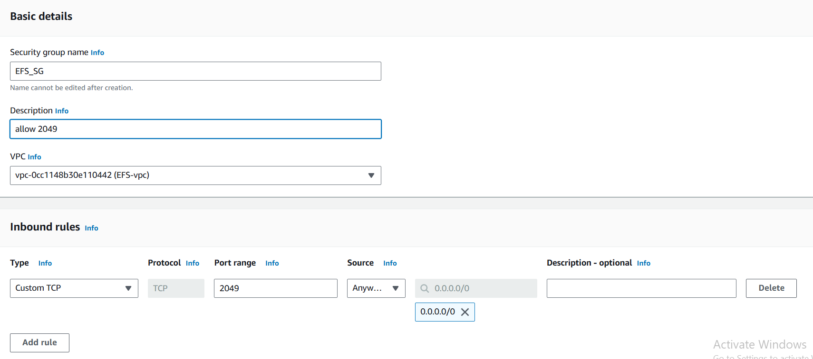
  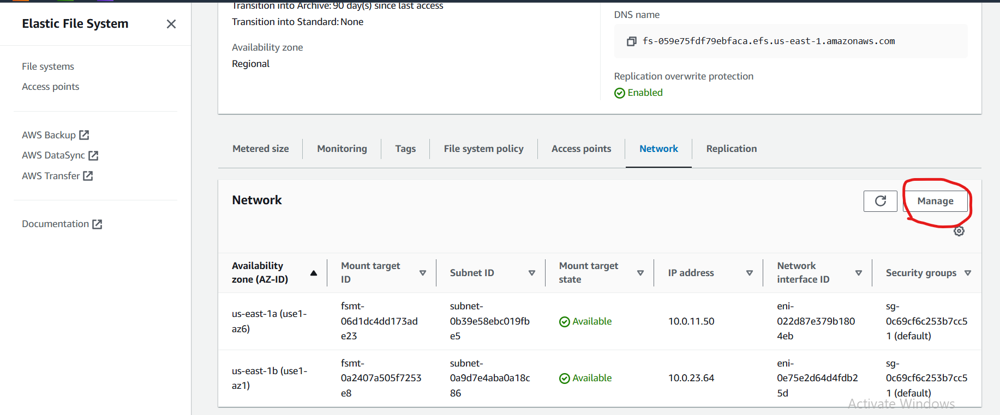
  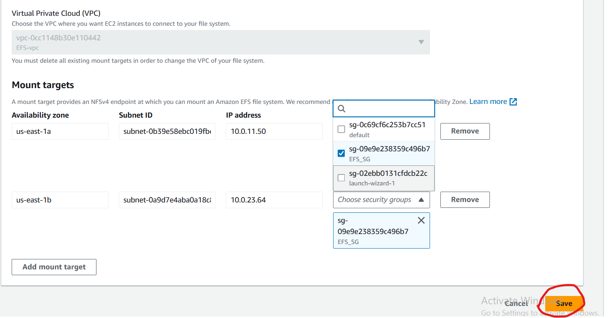
  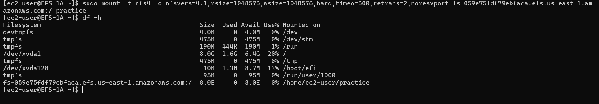
  
* Change the ownership of the folder and also mount in other server to.
  
  
  
* This folder which you have created in the server is mounted to EFS in the cloud.
* The data in this folder will be stored in EFS that you have mounted.
* Try to create a file and add content in that folder and check in other server if data is present or not.
  
  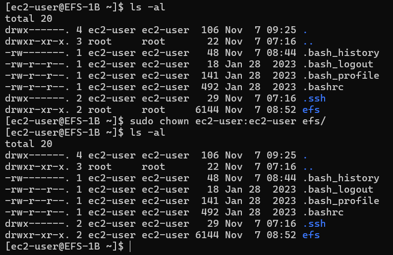
  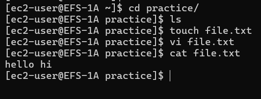
  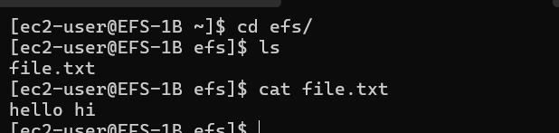

### what if we delete the data in one server?
* Whenever we are storing data in EFS is only the data that you want to share and copy of the data will be available in local server in other path.
* If anyone want to edit the file then user will copy the file and edit the file and then send to filesystem mounted path.
  
  
  