# **IAM (Identity Access Management)**
* In Organization, people will be working in different projects where each person will have different authorization.
* So these people will be added as users to the the AWS account, Organization will have single AWS account in which user will be added.

**_AWS Identity and Access Management (IAM) is a foundational service in Amazon Web Services (AWS) that allows you to manage access to AWS resources securely._**

* With IAM, you can create users, groups, and roles and control their permissions to interact with AWS resources.

Here's an overview of AWS IAM and how to set up users, assign permissions, and work with roles:

### **1. What is AWS IAM?**

* IAM enables you to:

    - **Manage Users:** Create users and assign them permissions.
    - **Control Permissions:** Specify what actions users and services can perform.
    - **Secure Resources:** Enforce least privilege by giving specific permissions as needed.

### **2. Creating Users and Assigning Permissions in IAM**

* IAM users are individual entities that allow people or applications to access your AWS account.

**Steps to Create Users:**
  1. Go to the IAM Console: Open the IAM console.
  2. Add User:
      - Click on Users in the sidebar, then Add users.
      
      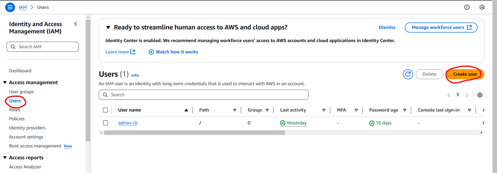 
 
  3. Provide a username and choose the Access type:

       - `Programmatic access (API/CLI).`
       - `AWS Management Console access (browser-based).`

      
      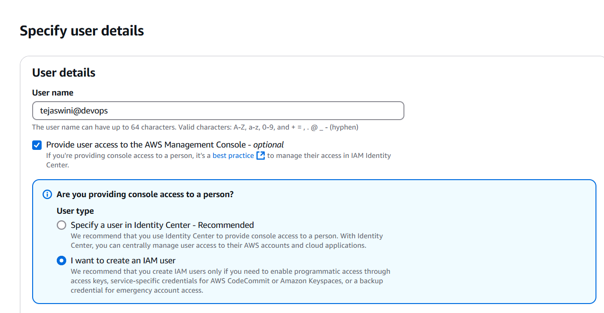 
            
      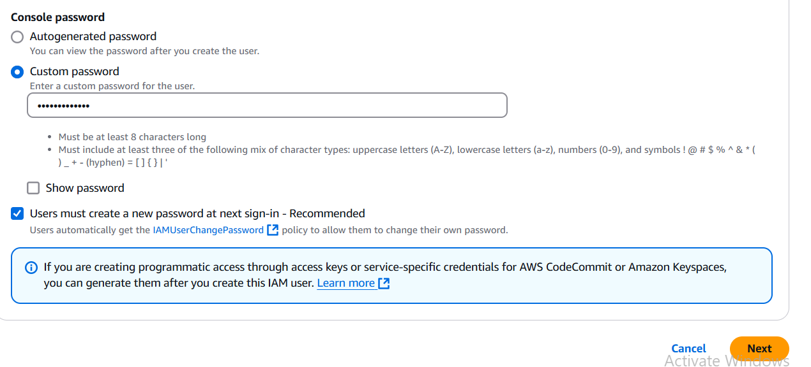 
 
 
  4. Set Permissions:
       - Attach existing policies (e.g., AdministratorAccess, ReadOnlyAccess, or custom policies).
       - We can set permissions in 3 ways.
            1. Adding user to a group
            2. Copying the permissions from other user.
            3. Attaching the policies directly 
        
     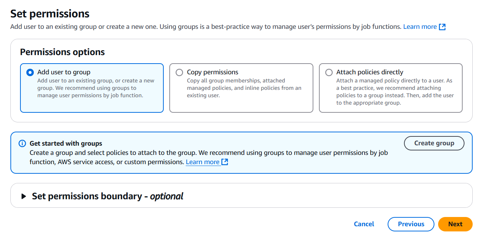
           
     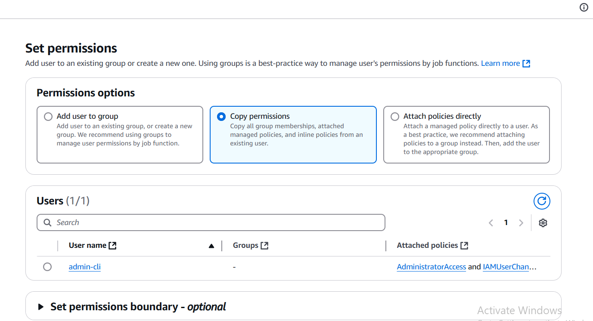 
      
     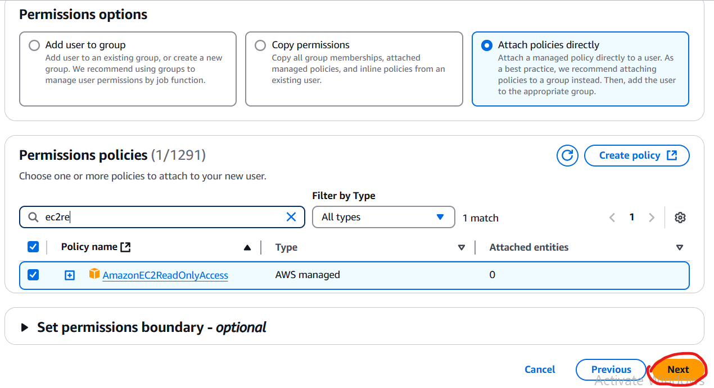 
 
### **3. Groups**

* Imagine there are 10 people belongs to same team. Instead of giving access individually we can create a group and add user to that group.
* We can add permissions at group level. The users in the group will get the Access according to the group level permissions eventhough user have limited access.
* One user can be the part of multiple users.

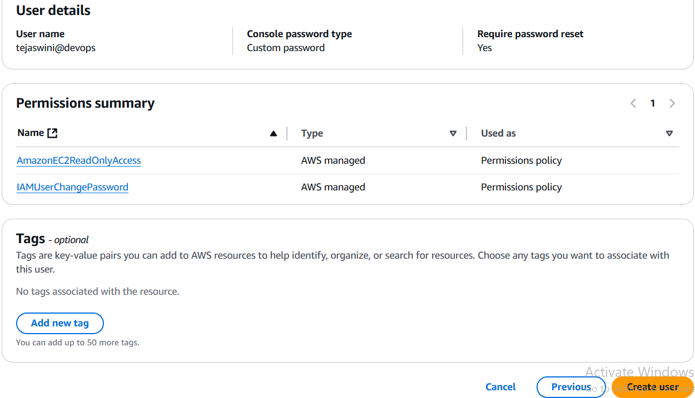
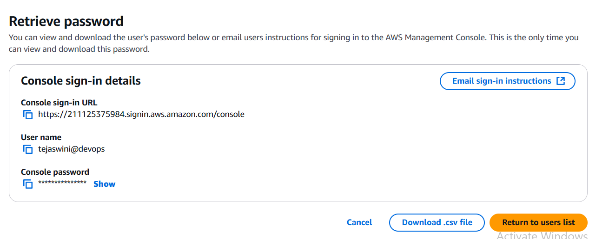
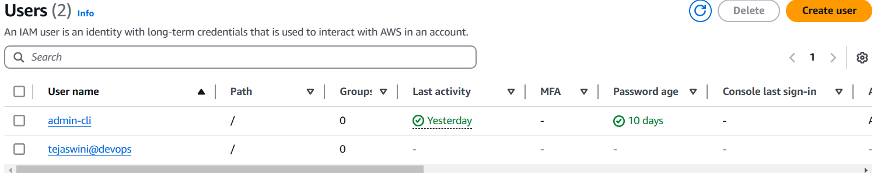
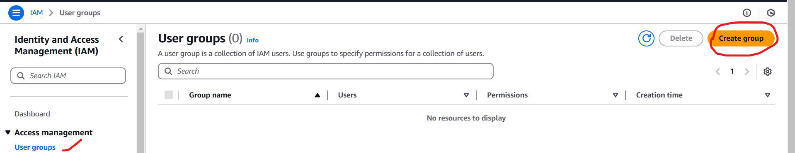
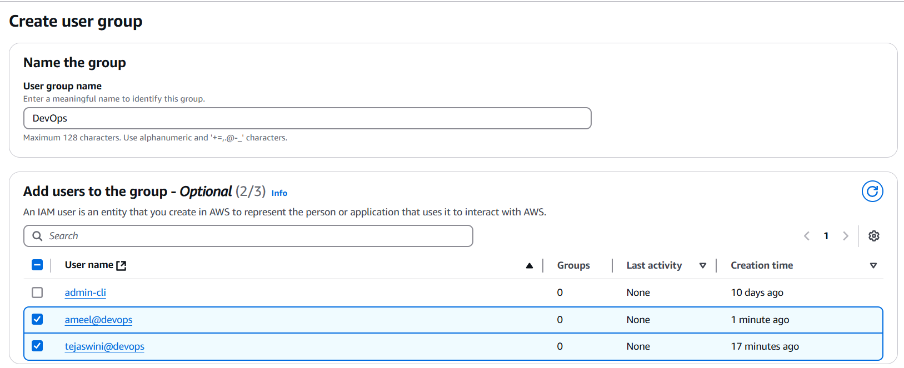
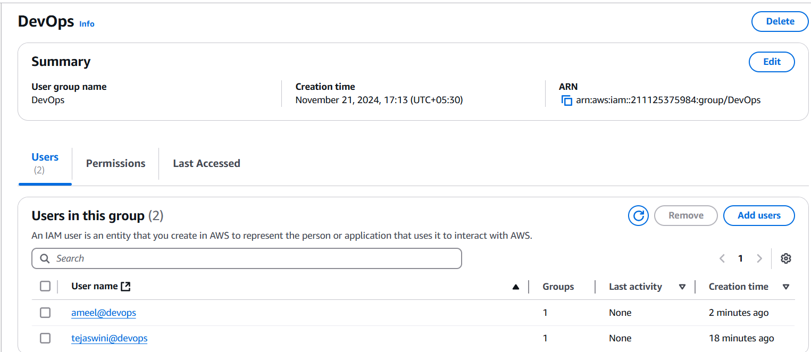

### **4. Add user to a group with predefined permissions.**
1. Copy permissions from another user.

   * `Tags (Optional):` Add metadata tags to organize users.
   * `Review and Create:` Review settings and click Create user.
   * `Assigning Permissions:`
       * You can use Managed Policies (predefined by AWS or custom) or Inline Policies (attached directly to a single user).
   * Attach a policy to specify what actions the user can perform.

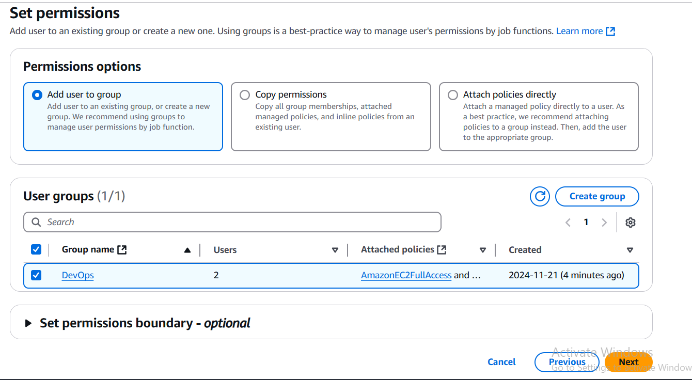
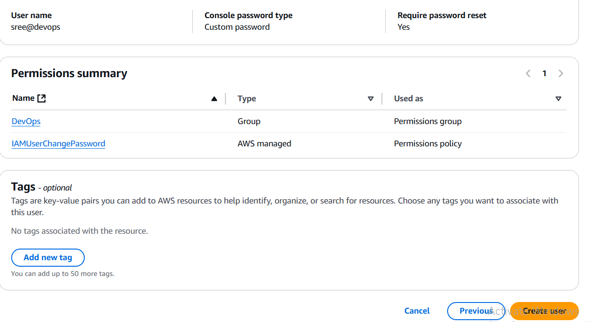

### **4. What are IAM Roles?**
* IAM roles are similar to users but are meant for workloads, services, or applications rather than individuals. 

**Roles:**
  * Allow AWS services (like EC2, Lambda) to interact with other AWS services.
  * Can be assumed by users or applications, allowing temporary access.

### **5. Creating and Assigning Roles to EC2**
* Roles for EC2 instances allow them to securely interact with other AWS services.

**Steps to Create and Assign an IAM Role:**

1. **Create a Role:**

   * Go to the IAM Console, select Roles, and click Create role.
   * Choose AWS service and select EC2 as the trusted entity.

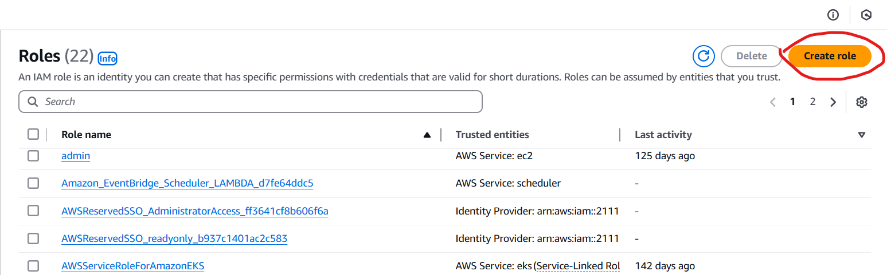
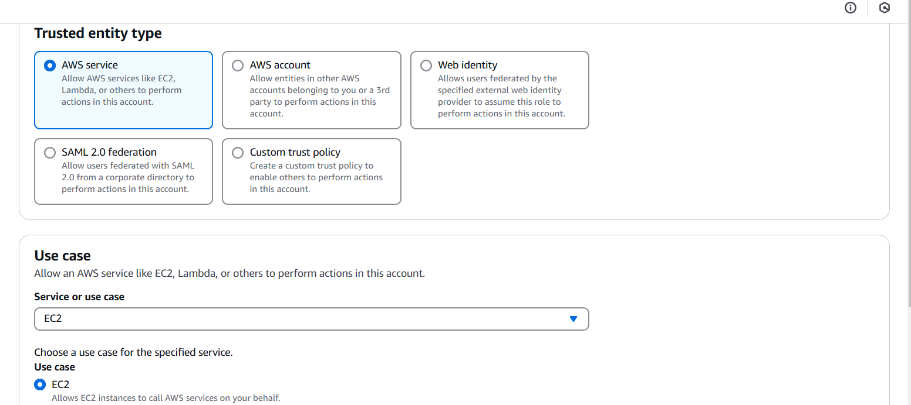

2. **Attach Permissions:**
   * Choose an existing policy (e.g., AmazonS3ReadOnlyAccess for accessing S3 buckets) or create a custom policy.

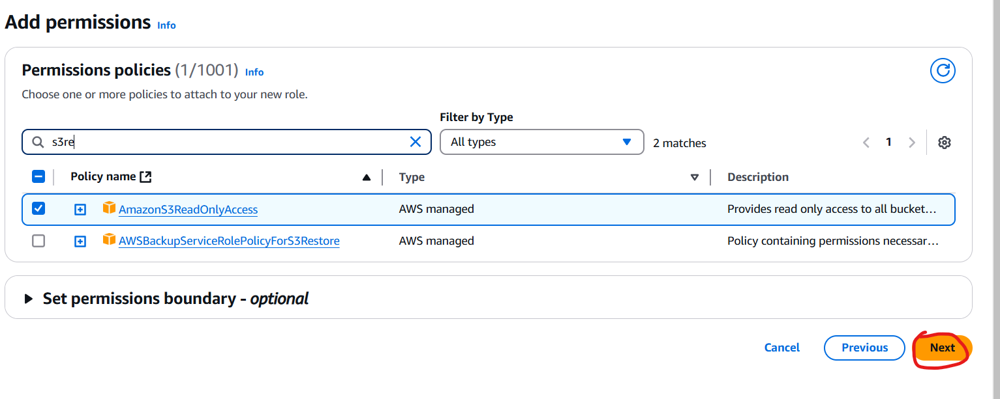

3. **Review and Create Role:** Name the role, review, and click Create role.
4. **Assign the Role to an EC2 Instance:**

   * Go to the EC2 Console and select the instance.
   * While creating EC2 we can attach the iam role launch instance --> advanced settings --> instance profile --> select the role
  
  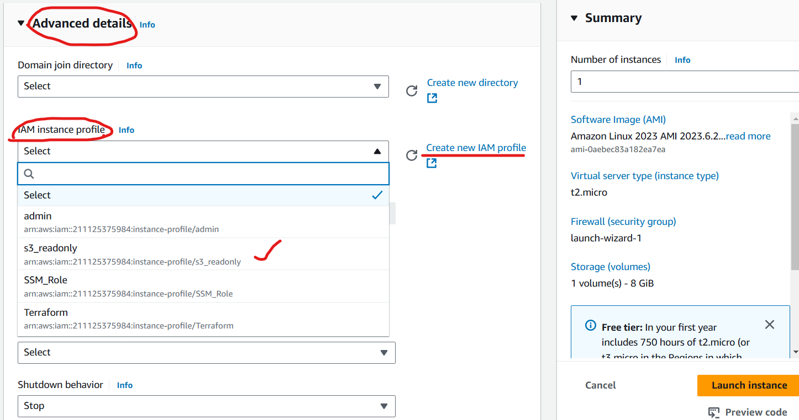

   * Actions --> Security --> Modify IAM Role.

  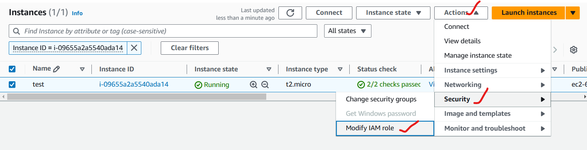

   * Choose the IAM role you created,then click Update IAM role.
  
  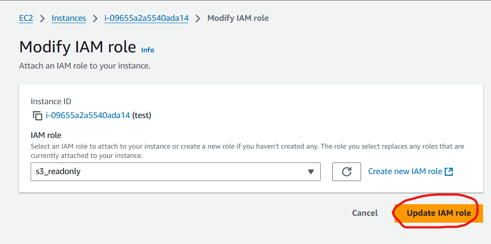

  * Once the role is assigned,the EC2 instance can access resources per the role's permissions without requiring embedded credentials.

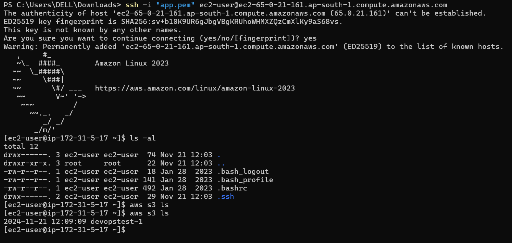

