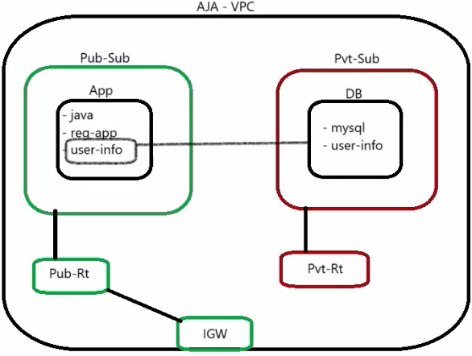
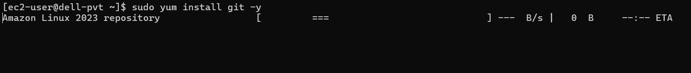
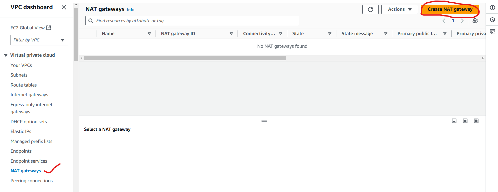
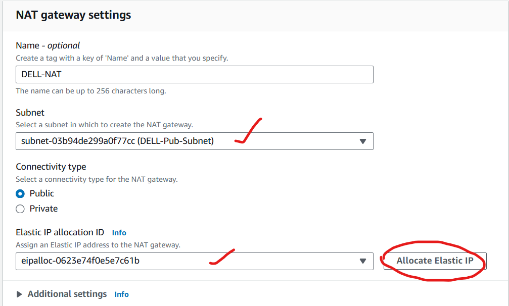
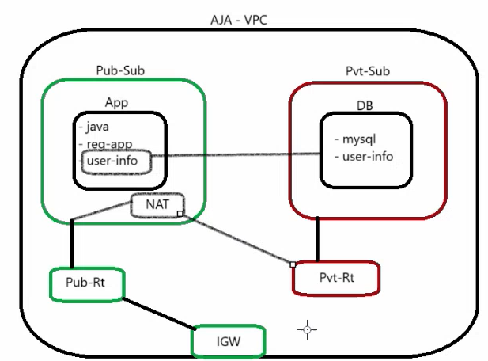
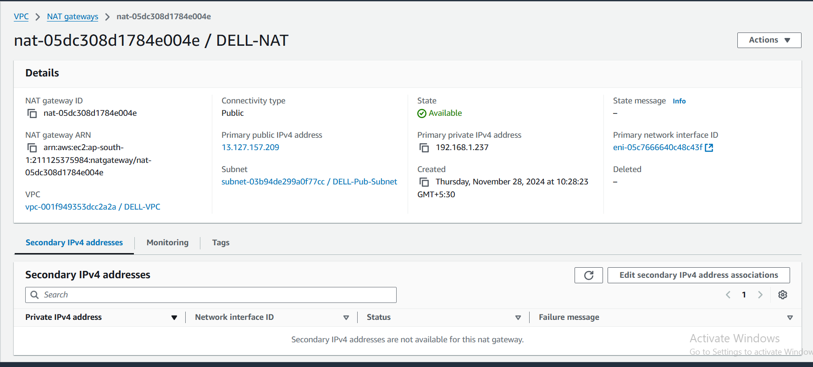
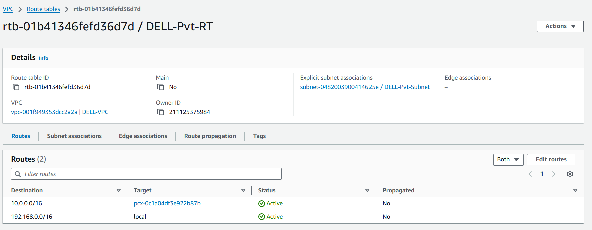
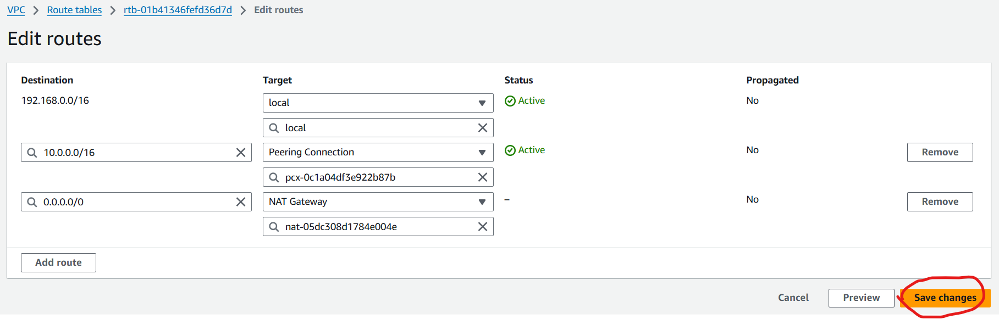
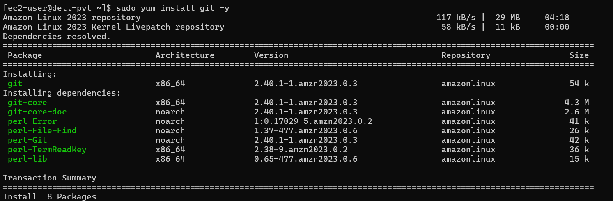

# NAT(Network Address Translation)

* Client Requirement will be like below.
  
  

* But to setup DB in private network we need download few packages but without internet we can't download. Our DB server will be in private subnet.
* To download packages in private server we have two options 
    1. Attach private subnet to IGW(Not suggestable because our private subnet will be exposed to internet, outside of network can also access our private subnet)
    2. NAT Gateway

**_"NAT Gateway is a highly available AWS managed service that makes it easy to connect to the internet from instances eith a private subnet in a VPC"_**

* NAT gateway is just like IGW but have oneway communication only.

### Configure NAT Gateway
* If we try to install any packages in Private server, It is not downloading.
  
  

* VPC-->NAT Gateway --> Create NAT Gateway

* Whenever we create a NAT gateway, We create it under pulic subnet.

* Next create the NAT gateway.
* We create NAT in public subnet which have internet access, After that NAT is attached to private route table.
  
  

* Now try to download the packages you want in private server.

* After configuration is done EC2 in pricate subnet can download resources form WWW. But noone from WWW can access our pricate server.