# RDS (Relational Database Service)

* As per client requirement, wants the application to be run on public subnet.
* Client wants the DB to run in private subnet.
* For this RDS lets configure with a java project.
* So this project have user login and registration for this user details should be stored in DB.
* We can go ahead and create the databse manually in private subnet but Install, setup,cofiguration, storage all these should be managed by database admin(Extra man power)
* Ratherthan going through that process we can goto cloud and request for PAAS --> RDS.

## Create a RDS
* RDS --> Create Database
  
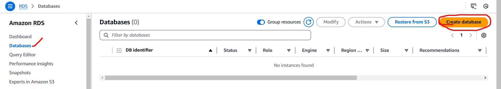

* We have two options 
    1. Standard --> Most of the configurations can be selected by us
    2. Easy --> AWS will manage most of the configurations 
   
   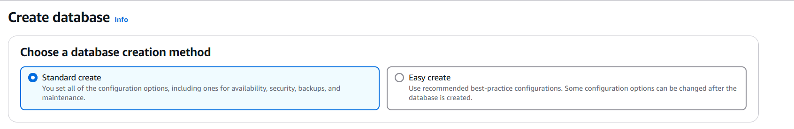

* **Engine options**, AWS is providing 8 database types Where I am selecting mysql because my code is compatitable with MySQL 5.7 version
  
  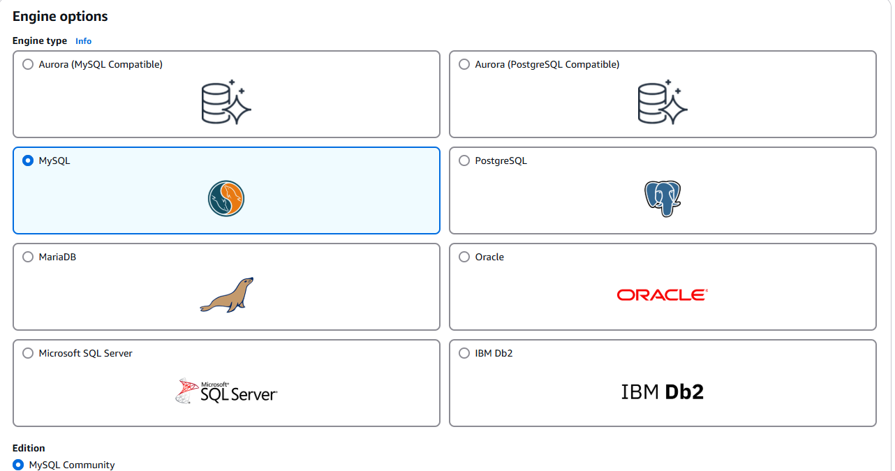
  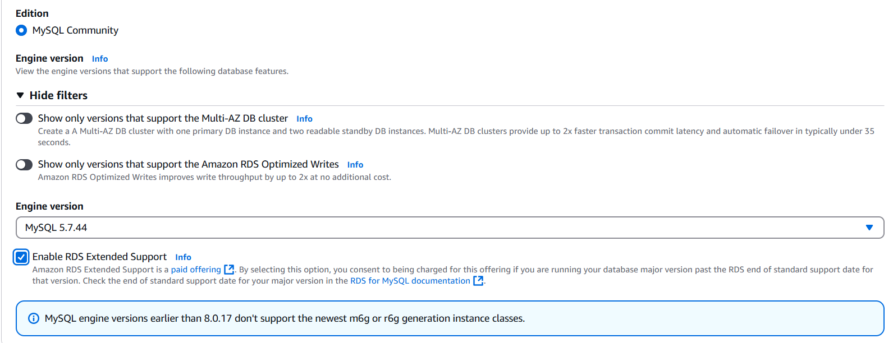

* AWS is providing **templates** for different environments.
  
  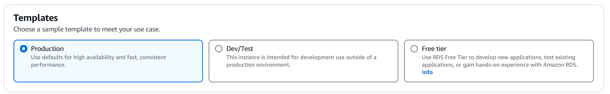

* If I select production lets see the options we have.
* Next is **availablity & Durability**, Multi-AZ DB instance means it will create instances in multiple availability zones for high availability.

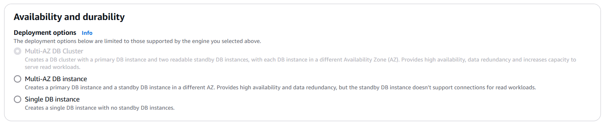 

* Provide a name to the database.

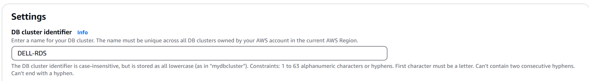

* In **credentials settings**, We have two options to manage our credentials
    1. Managed in AWS secrete manager --> Password will be managed by AWS key manager
   
   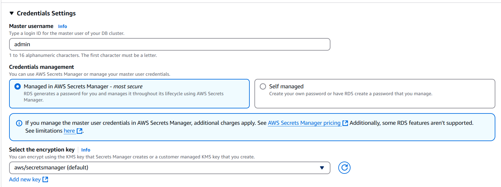

    2. self managed --> For now I will be using this option for simplicity. Where can create a password by your own.
   
   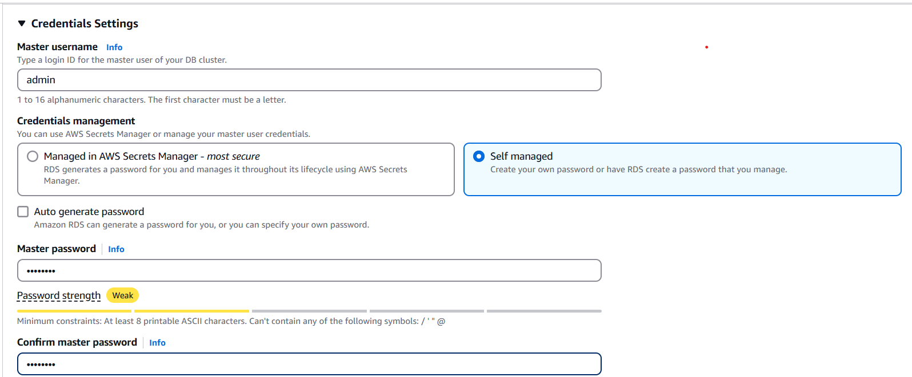

* **Instance configuration**, for production we have lot of instance types AWS providing.
  
  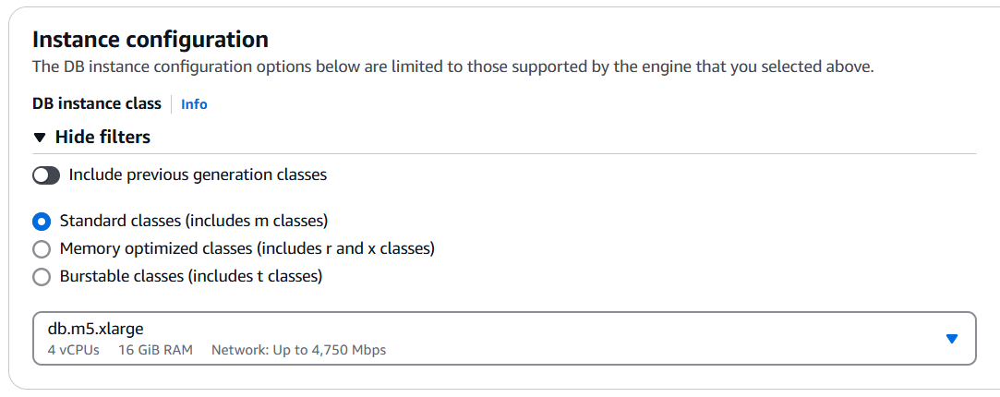

* **Storage**

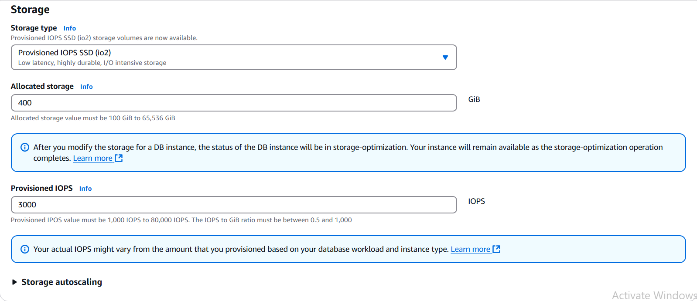

* We have storage autoscaling option in RDS.
  
  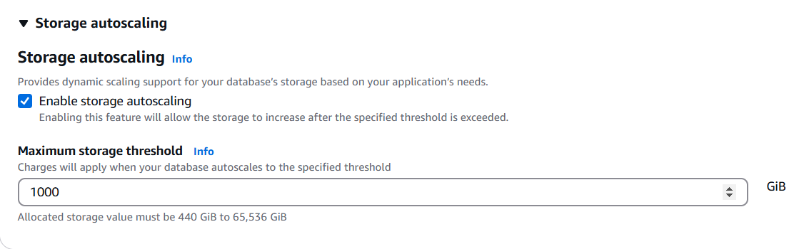

* AWS will manage the storage of database, If allocated storage is completed then it will extend upto mentioned threshold value.
* **Connectivity**, We have to select the network that RDS wanted to be created.
* Public acess we have two options:
    1. yes --> RDS can be connected with servers which are in other VPCs.
    2. no --> RDS can be connected with servers within the network.
* Create a Security group allowing 3306 port because mysql run on 3306.

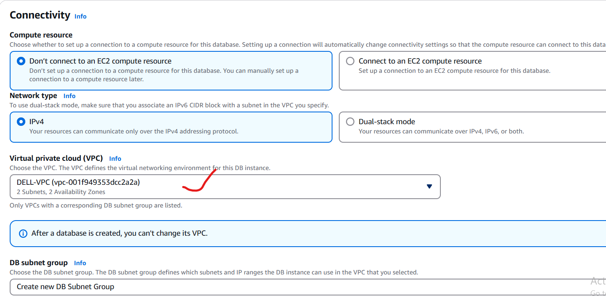
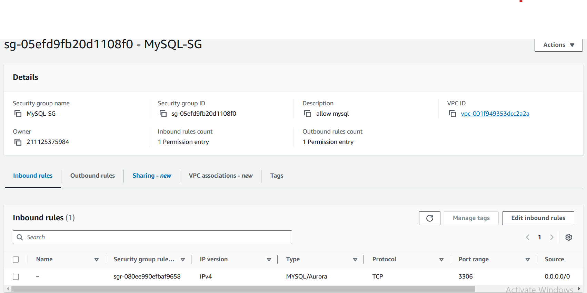
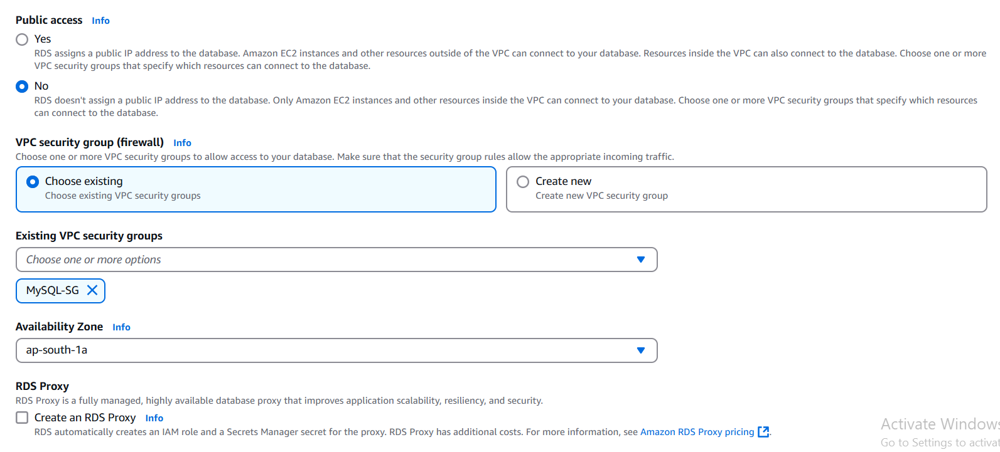
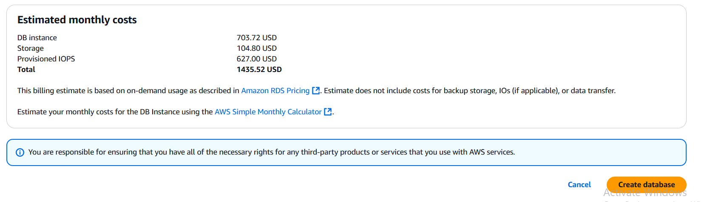

* And then create above configurations is for production but coming to Free tier few options are disabled

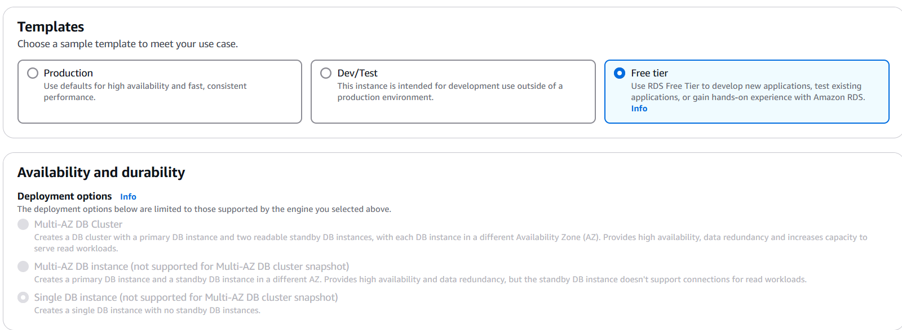
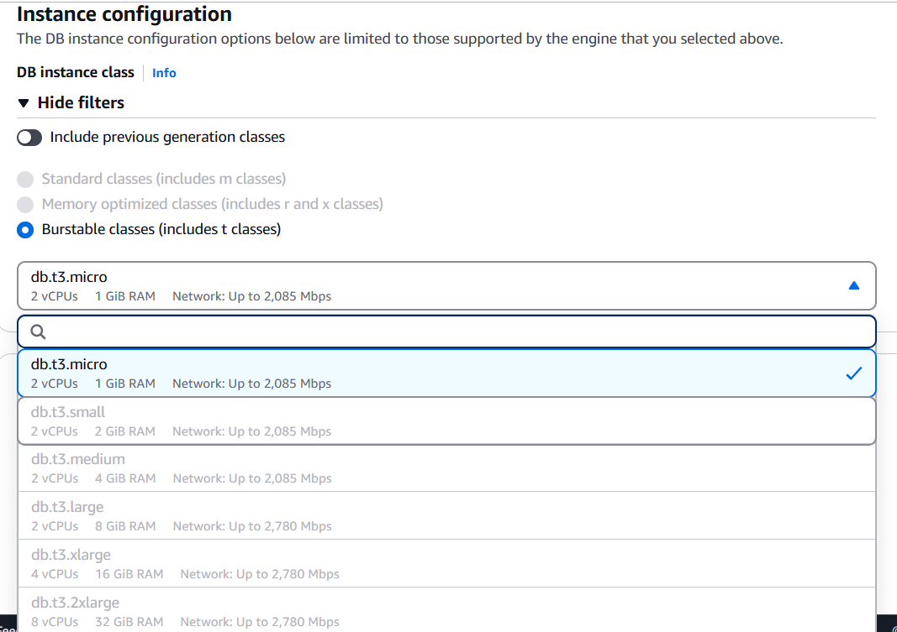
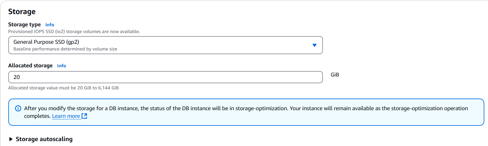
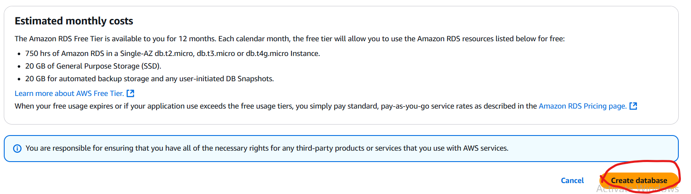
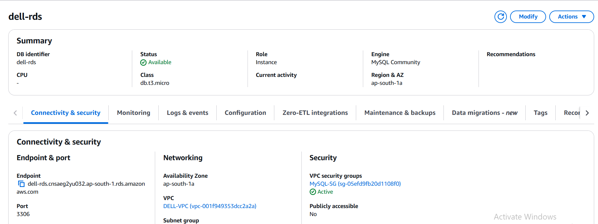

* Now install mysql in private server so that we can connect with rds, we should connect database from private subnet only.
```bash
sudo yum -y install mariadb105
mysql --version
```
* To login with RDS MySQL
```sql
mysql -h dell-rds.cnsaeg2yu032.ap-south-1.rds.amazonaws.com -u admin -p
```
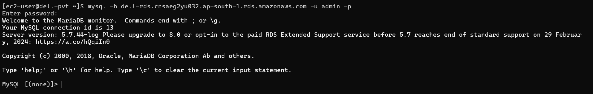

* Now we have to create a table for user registration and database is jwt according to the code.
```sql
CREATE DATABASE jwt;
USE jwt;
CREATE TABLE `USER` (
  `id` int(10) unsigned NOT NULL auto_increment,
  `first_name` varchar(45) NOT NULL,
  `last_name` varchar(45) NOT NULL,
  `email` varchar(45) NOT NULL,
  `username` varchar(45) NOT NULL,
  `password` varchar(45) NOT NULL,
  `regdate` date NOT NULL,
  PRIMARY KEY  (`id`)
) ENGINE=InnoDB DEFAULT CHARSET=latin1;
```

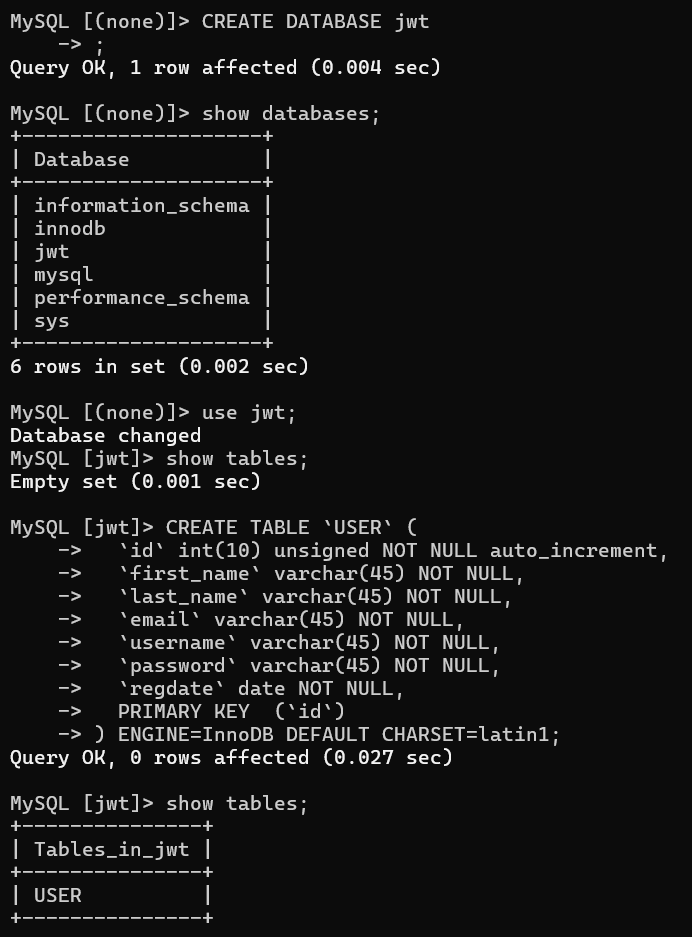

* Till now we setup the backend to store the details of user from the application, Now we have to configure frontend.
* In public server we will setup the application.
* Install git so that we can clone the code.
* Install java and maven. java for run time and to build the code we need maven.
* Maven will setup some goals like build,Test, Deploy,Unit
* Build means converting the human readable code to machine readable code.
```bash
sudo yum install -y git
git clone https://github.com/Ai-TechNov/aws-rds-java.git
sudo yum install -y java-1.8* maven
```
* Database we created should be integrated with our application.
```bash
vim src/main/webapp/login.jsp
vim src/main/webapp/userRegistration.jsp
```
  - In [login.jsp](https://github.com/AWS-DevOps-BasicS/Cloud-Computing/blob/main/AWS-RDS/aws-rds-java/src/main/webapp/login.jsp) --> In connectioncon update your db details like database host, username and password
  - In [userregistration.jsp](https://github.com/AWS-DevOps-BasicS/Cloud-Computing/blob/main/AWS-RDS/aws-rds-java/src/main/webapp/userRegistration.jsp) --> Update like above.

* After configuration is done, bulid the code.
*  For me by default java 17 is using but to change the java version 
```bash
sudo alternatives --config java
```
* This will display a list of installed Java versions, similar to:
```bash
There are 2 programs which provide 'java'.

  Selection    Command
-----------------------------------------------
*+ 1           /usr/lib/jvm/java-17-amazon-corretto.x86_64/bin/java
   2           /usr/lib/jvm/java-1.8.0-amazon-corretto.x86_64/jre/bin/java

Enter to keep the current selection[+], or type selection number: 2
```
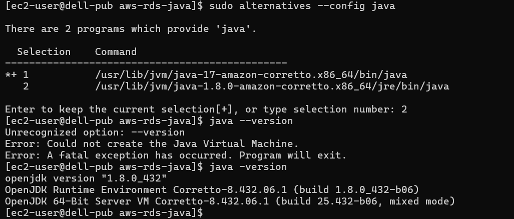

* Temporary Switch to Java 1.8
* If you only need Java 1.8 for a single session:
```bash
export JAVA_HOME=/usr/lib/jvm/java-1.8.0-amazon-corretto
export PATH=$JAVA_HOME/bin:$PATH
```
* This will set Java 1.8 for the current session only.

* Now build the package.
  
```bash
mvn package
```
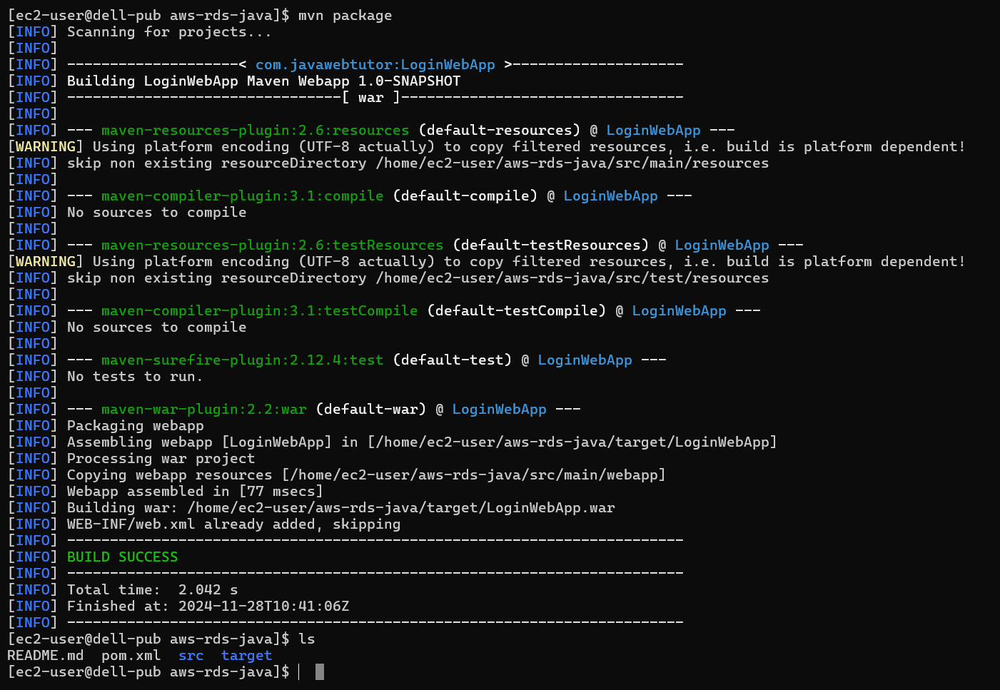

* LoginWebapp.war(artifact which will be deployed in webserver like tomcat) will be created in target folder.
  
  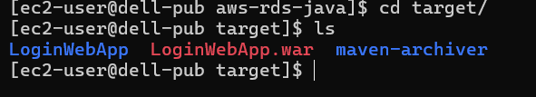

* Download Tomcat Webserver.
```bash
wget https://dlcdn.apache.org/tomcat/tomcat-9/v9.0.97/bin/apache-tomcat-9.0.97.tar.gz
tar -xvf apache-tomcat-9.0.97.tar.gz # to extract the files
```
* Now start the tomcat server.
```bash
cd apache-tomcat-9.0.97/bin
./startup.sh
```
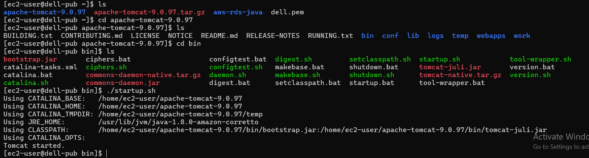
* We need to allow the tomcat port to access.running on 8080 port

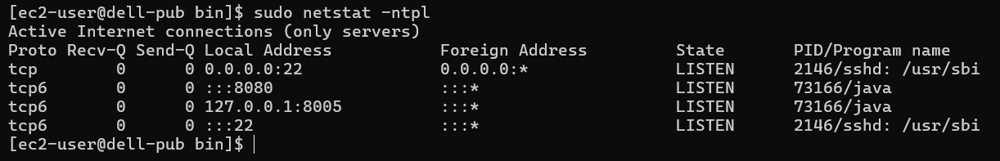

* After allowing 8080nport in security group which is attached to public server you can check the tomcat page.
  
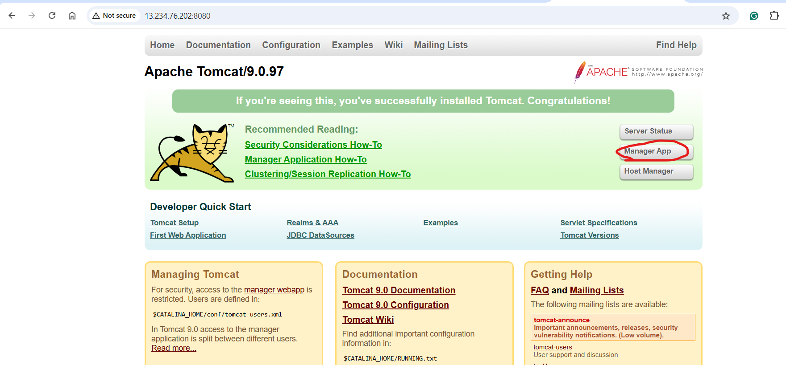
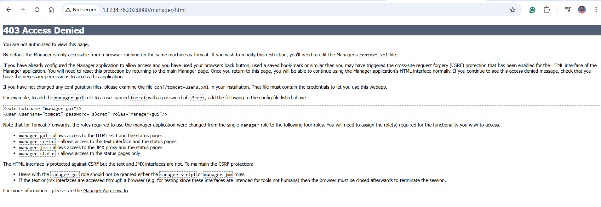

* We don't have access to manager app but we can access it through server where tomcat is installed so to allow access from browser. For that we need to go to manager's context.xml file and comment the line which are giving access to only local.

```bash
find -name context.xml
```
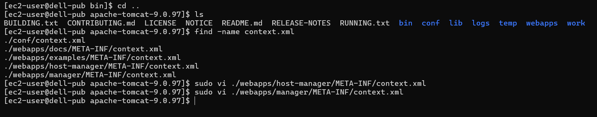
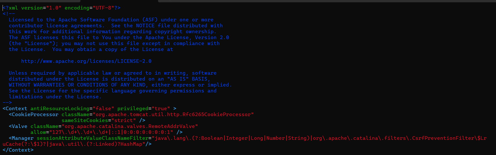
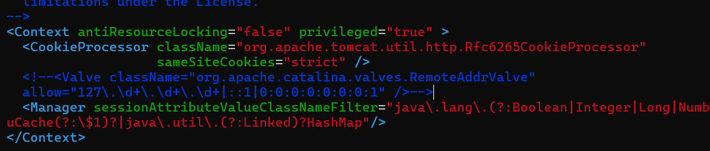

* After modifying tomcat knows that access can be from anywhere.

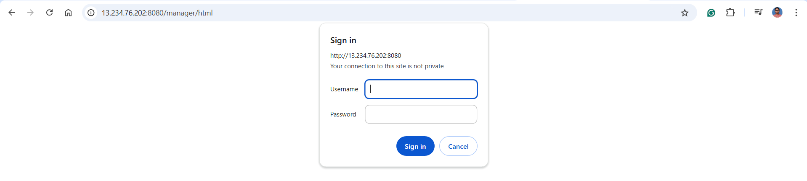
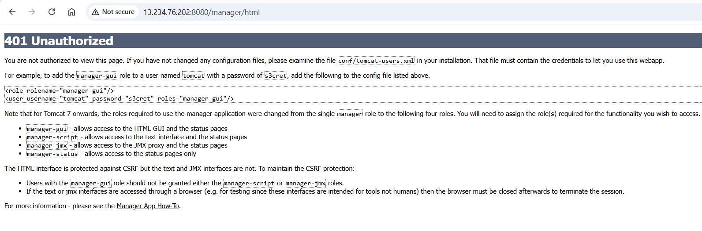

* Now it is asking for username and password. In conf/tomcat-user.xml file we need to update the profile details.

```bash
 sudo vi conf/tomcat-users.xml
 # shift+g will take youo to the bottom of the file where you can add profile details.
```
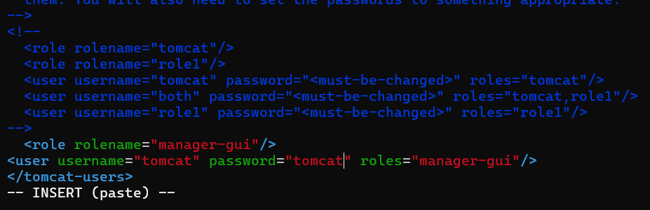

* You can change the username and password.
* Now check the page.
  
  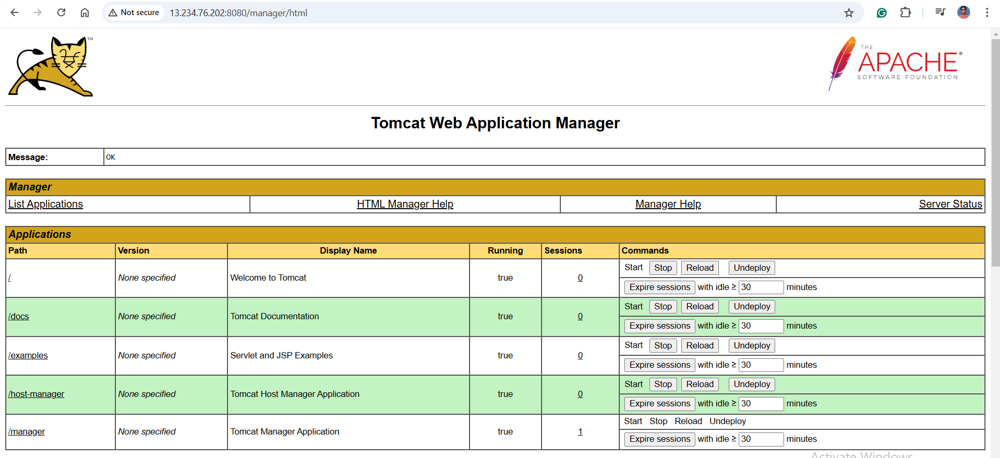

* In webapps folder also we have similar folders as above page.

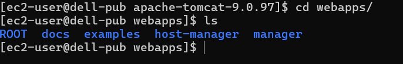

* So we have to copy the war file to webapps.
```bash
cp aws-rds-java/target/LoginWebApp.war apache-tomcat-9.0.97/webapps/
```

* Now refresh the page once and check if logicwebapp is present or not.

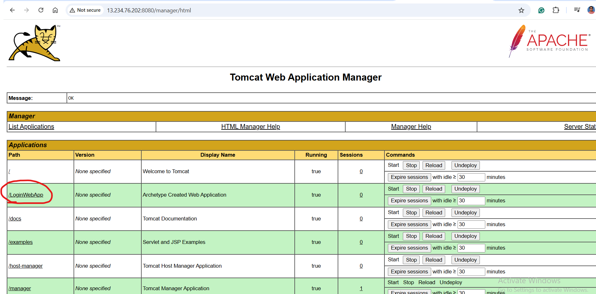
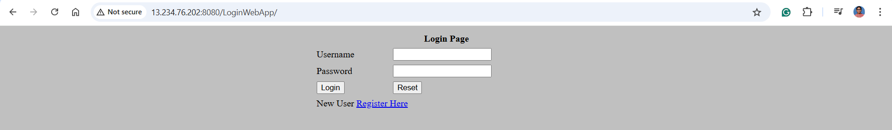
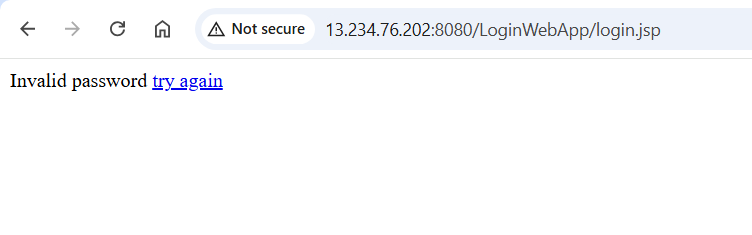

* Getting invalid user because 1st user need to register then only he can login.

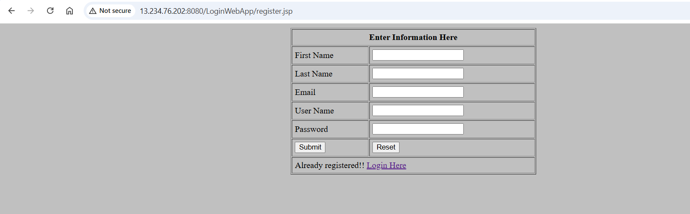
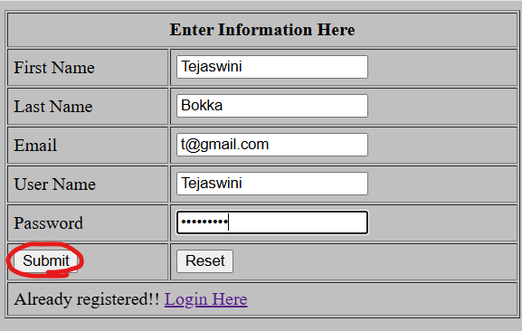

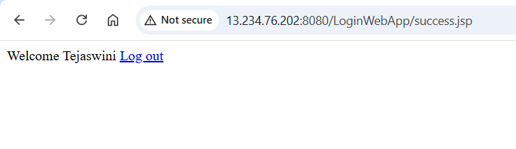

* Before and after clicking on submit.

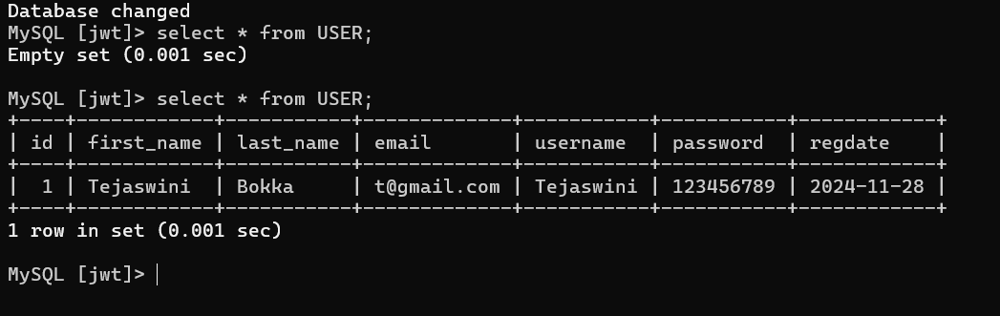


### The data received through the app will be stored in the DB in the backened !!!
