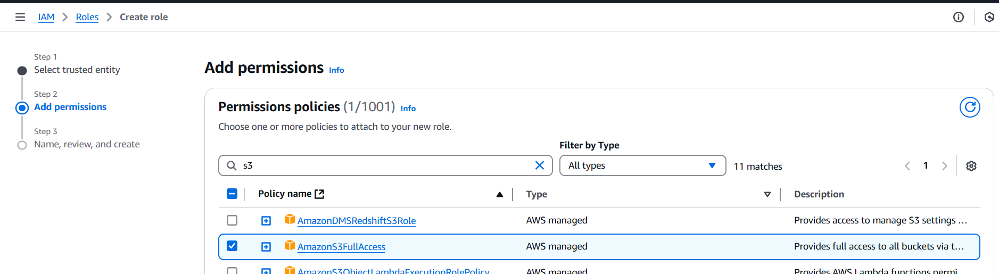

# AWS Transfer Family
* In S3 bucket, We can upload file upto 160GB through console for the file greater than 160 GB we have to use AWS CLI, AWS SDK or Amazon S3 rest API.
* We also have other option AWS Transfer family where we can directly upload the file from our local machine to S3(Like our cloud drive).
* AWS transfer family simplifies migration of SFTP, AS2, FTPS & FTP based workflows to AWS.

**_Easily manage and share data with simple, secure and scalable file transfers_**

### Benefits
1. Easy to scale
2. Store in S3 or Amazon EFS
3. Migration

### Usecases
1. Modrenize your managed file tarnfers
2. Gain insights by growing your datalake.
3. Improve collaboration across your trading partner network
4. Expand your cobtent distribution business.

[Refer Here](https://docs.aws.amazon.com/transfer/latest/userguide/what-is-aws-transfer-family.html) for official documentation on AWS Transfer family.

### **Lab - Create an AWS Transfer family**

#### **Step-1: Prerequisites**
1. **VPC and Subnet:** Ensure you have a VPC with private or public subnets.
2. **S3 Bucket:** Have an S3 bucket ready to store uploaded/downloaded files.
3. **IAM Role:** Create an IAM role with policies to allow Transfer Family access to your S3 bucket.

#### **Step-2: Create an IAM Role**
1. Navigate to `IAM` Console → `Roles` → `Create Role`.
2. Select `AWS Service` → `Transfer Family`.
3. Attach the following policy:
    - `AmazonS3FullAccess` (or custom policy for bucket access).
4. Finish creating the role and note its ARN.
   
   
   
   
   

#### **Step-3: Create a Transfer Family Server**
1. Go to the `AWS Transfer Family` Console.
2. Click `Create Server`.
   
   

3. Configure the server:
    * `Protocol:` Choose SFTP, FTPS, or FTP.

    

    * `Identity Provider:`
        * Use Service-managed for a simple setup.
        
        

        * Use Custom for external identity providers like LDAP.
          
        
                
        
        
    * `Logging (Optional):` Enable CloudWatch for server logs.
4. Choose `Endpoint` Type:
    * `Public:` Accessible over the internet.
    * `VPC:` Accessible within your VPC.
    * `VPC Endpoint:` Uses AWS PrivateLink.
        
        
                
        

5. Choose the domain.
           
    
        
        
6. Select the VPC and Subnets (if applicable).
7. Click Create Server.

#### **Step 4: Configure a User**
1. Navigate to your `Transfer Family server` and click `Add user`.
2. Specify:
    * `Username`.
    * `Role ARN:` Use the ARN of the `IAM role` created earlier.
    * `Home directory:` Path in your `S3 bucket` (e.g., s3://your-bucket/home/username/).
    * `Public Key (for SFTP users):` Upload an SSH public key.
  

### **Step 5: Test the Server**
1. Retrieve the server endpoint from the Transfer Family Console.
2. Use an SFTP/FTP/FTPS client (like FileZilla or WinSCP) to connect:
   * `Host:` Server endpoint.
   * `Port:` Depends on the protocol (e.g., 22 for SFTP).
   * `Username:` Configured user.
   * `Authentication:` Password or SSH key.

* Left side is S3 bucket, Right side is local machine.

*  We can drag and drop the folder or files to the bucket from local.

