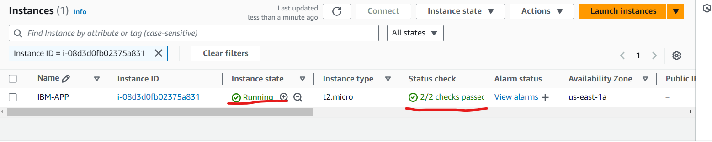
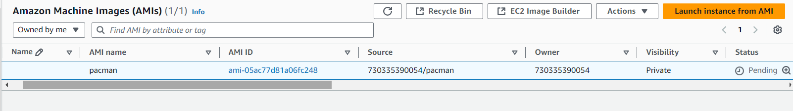

# Application Deployment
* After creation of Network, We have create servers to run our application.

### Create an EC2 instance
* Go to EC2 console --> Launch Instance
  
  

* Select the Instance flavour.
  
  

* Select type of instance.
  
  

* Now we have to create a key pair to connect with the server a=we are creating.
  
  
  
  

* Now you have to select in which network you wanted to create the server.
  
  
  

* Now create the Security group.
  
  

* Select the volume size and launch instance.
  
  

### Application Deployment in EC2 manchine using httpd Web-server.

* Create a ec2 instance and connect(login) with that instance.
* Log into the ec2 instance using keypair we created.
  
  
  
  

* We can also connect with the server using console.
  
  
  

* Now install httpd and enable the httpd.
```bash
#Setup Web-Server
sudo yum -y install httpd

#start and enable web-server
sudo systemctl start httpd
sudo systemctl enable httpd
```


* Install git to get the code from github.
  
```bash
sudo yum install git -y
```
* Now clone the code to the `/var/www/html`

```bash
sudo git clone https://github.com/Akiranred/pacman.git /var/www/html/
```
* Now check the page.

   

### If we have 100 of servers to deploy the application?
#### Userdata:
* When you launch an Amazon EC2 instance, you can pass user data to the instance that is used to perform automated configuration tasks, or to run scripts after the instance starts.
* We can't login into each server and do the process. So in `Advanced settings` we have `Userdata`.
  
  
  

```bash
#!/bin/bash
sudo yum -y install git
sudo yum -y install httpd
sudo systemctl start httpd
sudo systemctl enable httpd
sudo git clone https://github.com/Akiranred/pacman.git /var/www/html/

```
* Now you can take any public ip and where the application is running or not.
  


* `Userdata` is used only before launching the instance. After launching the instance we can't modify `userdata`.

#### AMI (Amzon machine image):
* An Amazon Machine Image (AMI) is an image that provides the software that is required to set up and boot an Amazon EC2 instance. 
* Each AMI also contains a block device mapping that specifies the block devices to attach to the instances that you launch. 
* You must specify an AMI when you launch an instance.
* The AMI must be compatible with the instance type that you chose for your instance. 
* You can use an AMI provided by AWS, a public AMI, an AMI that someone else shared with you, or an AMI that you purchased from the AWS Marketplace.
* An AMI is specific to the following:
    * Region
    * Operating system
    * Processor architecture
    * Root device type
    * Virtualization type
* You can launch multiple instances from a single AMI when you require multiple instances with the same configuration.
#### Launch multiple instances from an AMI
* You can create an AMI from your Amazon EC2 instances and then use it to launch instances with the same configuration.
* You can copy an AMI to another AWS Region, and then use it to launch instances in that Region.
* You can also share an AMI that you created with other accounts so that they can launch instances with the same configuration.
* You can sell your AMI using the AWS Marketplace.

##### Creating an AMI:
* Select the EC2 instance from which you want to create an AMI.
  
  
  
  

* Wait till status is available and create multiple instances using the created AMI.
* Now create instances as per your need.
  
  

* Check the page.
  
  
  
