# Networking
* Inside the public cloud we can create a private cloud which is virtual.
* AWS provides `VPC(Virtual Private Cloud)` service to create a private cloud virtually.
* Dividing the network is called `Subnetwork` and the process is called `Subnetting`.
* To provide security for the network AWS have `NACL(Network Access Control List)`. `NACL` has a list of IP addresses  which should be allowed and denied.
* In virtual environment, If somebody want to reach you then you need internet access so AWS provides `IGW(Internet Gateway)` which provide internet access to nework(VPC).
* Traffic distribution between different subnets happends using `Route Tables`.
* We have to set a CIDR for the ip addresses and to create a VPC we need CIDR.
* To create a VPC IPV4 CIDR is using.
* **CIDR(Classless Inter Domain Routing):**
  * We have two types: 
      1. IPV4: it has 4 octets. each octet contains 8 bits. It is a 32 bit address.
      2. IPV6: 128 bits -->hexadecimal --> x:x:x:x:x:x:x:x
* Each octet have 8 bits that represents values from 0 to 255.
* To design the network cidr you use [cidr xyz](https://cidr.xyz/) calculator.
* Our client requirement is to have ip addresses for 8000. So CIDR is 10.0.0.0/19 where 32-19 = 13 --> 213=8192.
* **Network CIDR:**
  
  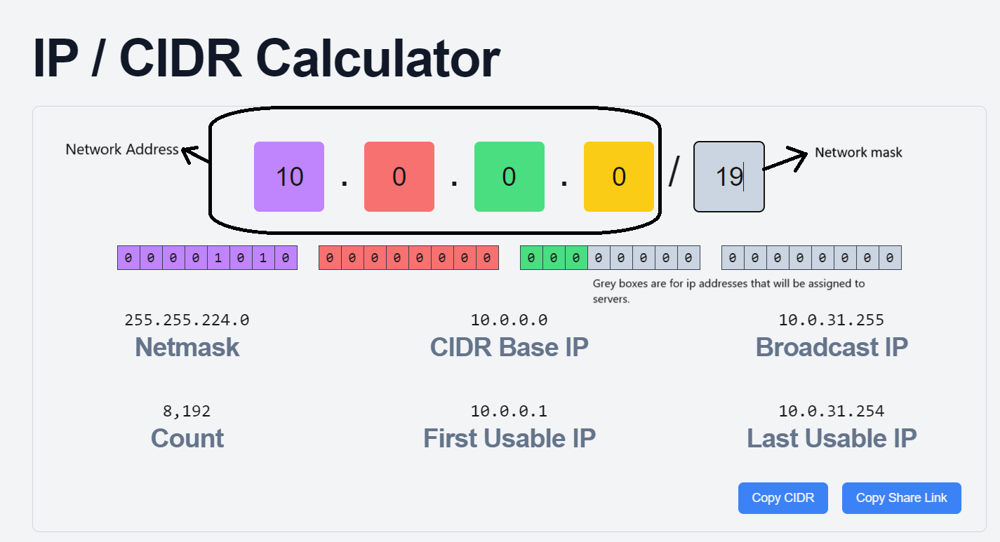

* But in future we may increase the number of server in the VPC then we can't modify the VPC cidr. So we will create with max subnet mask provided by AWS is `/16`.
* Each subnet should have capacity of 4k servers. 
  
* **Sunbet-1:** 
  
  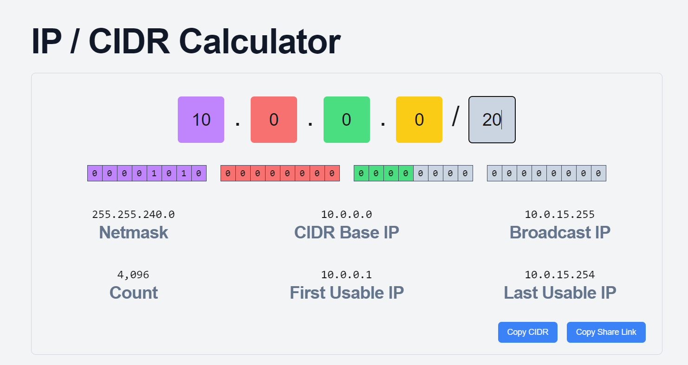

* **Subnet-2:**

  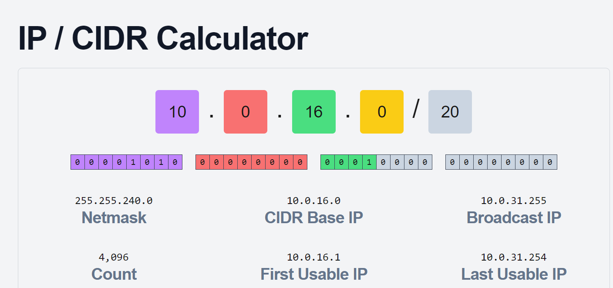

### Creation on VPC in AWS:
* In AWS console, go to search and search for `VPC`.
* Create  VPC --> Enter name of VPC --> Enter cidr range.
  
  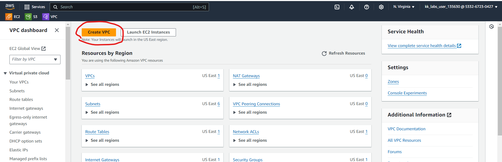
  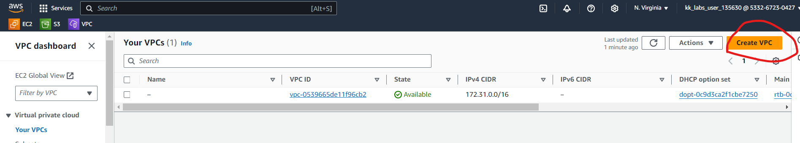
  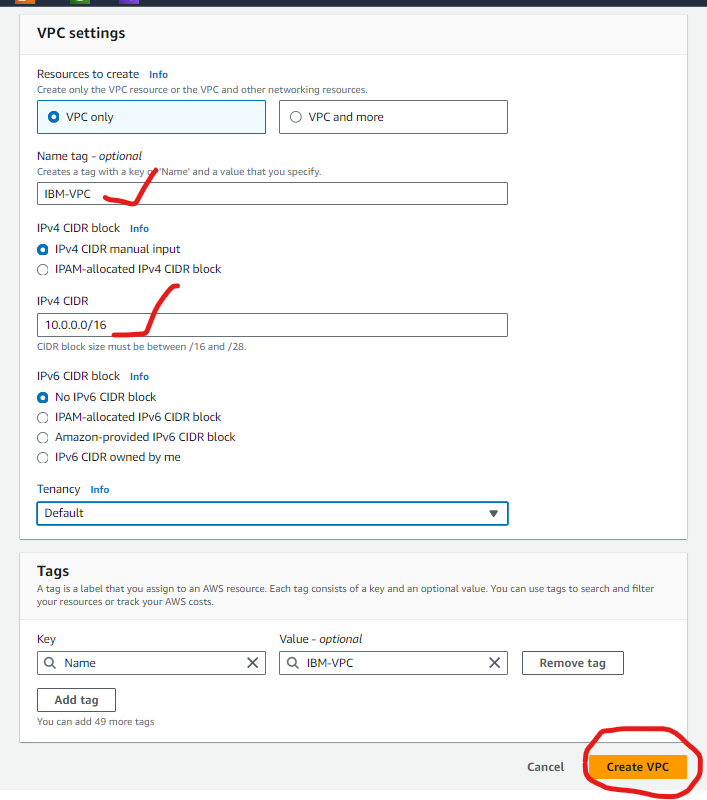

* Now we have create two subnets.
  
  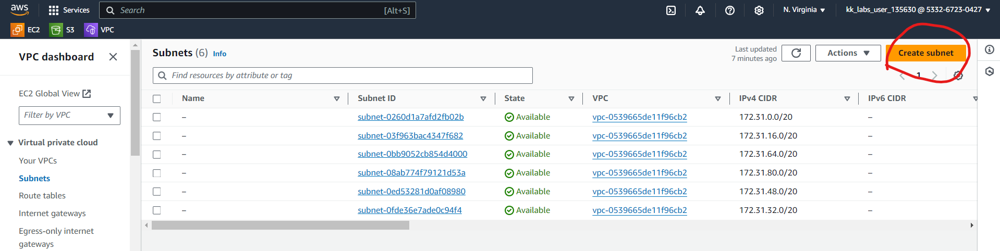
  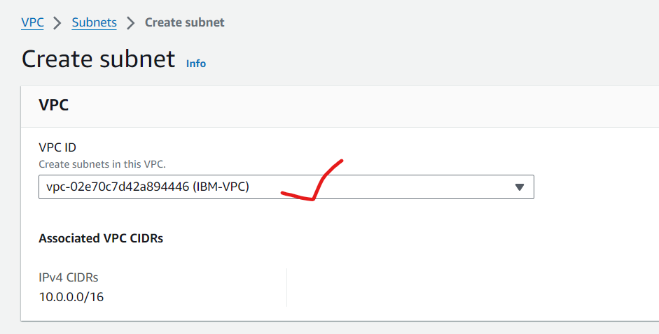
  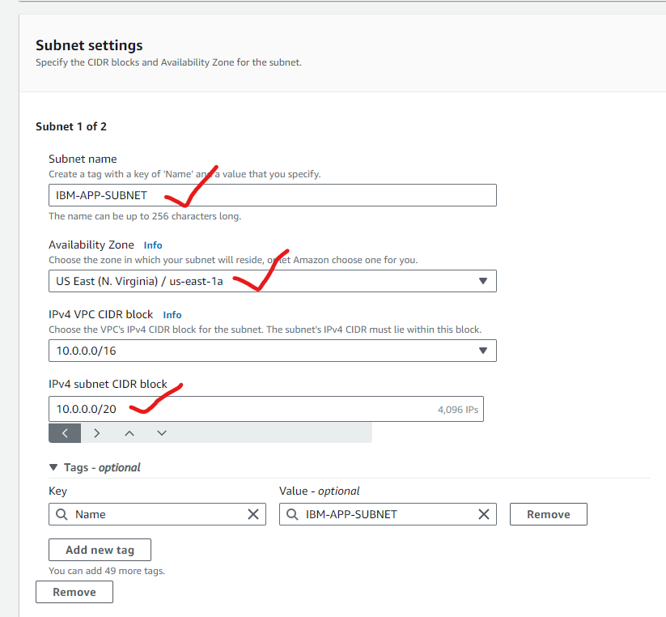
  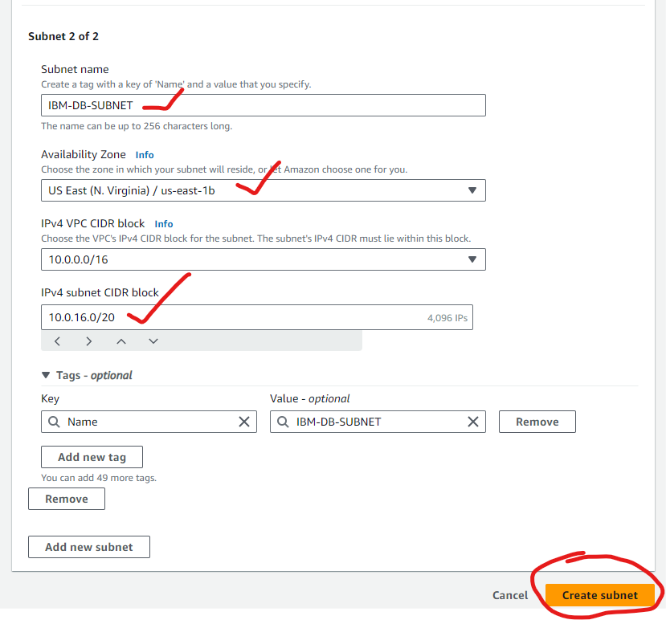
  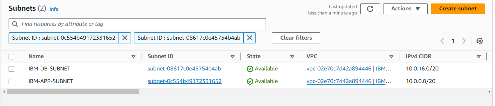

*  Now create two route tables one for app subnet and one for db subnet.
  
  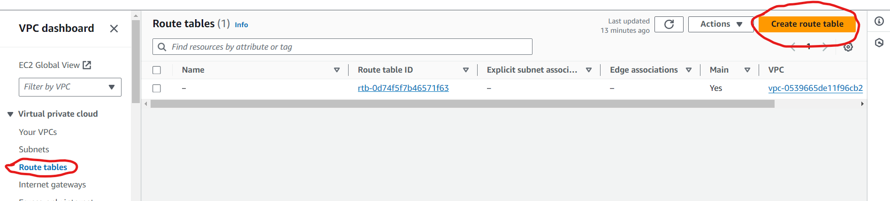

*  Create Route table for DB subnet similarlly create for APP subnet too. 
  
  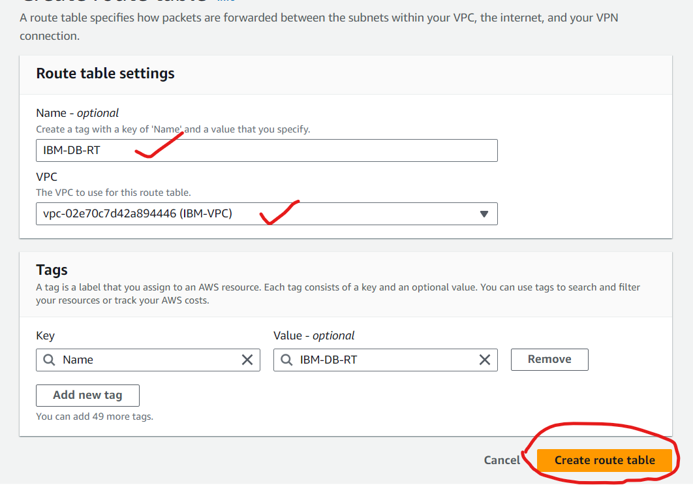

* After create of route tables in subnet association add the respective subnets.
  
  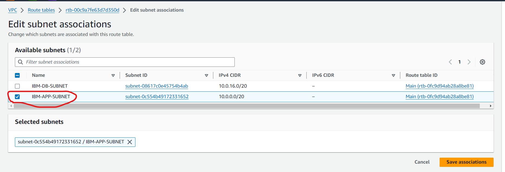
  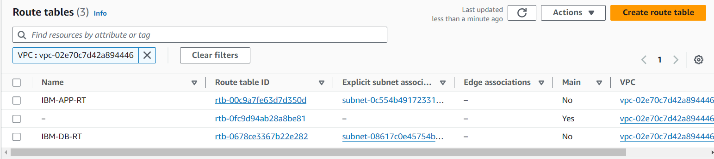

* For internet access to the network we created earlier we have to create IGW.
  
  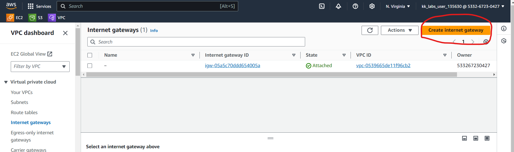
  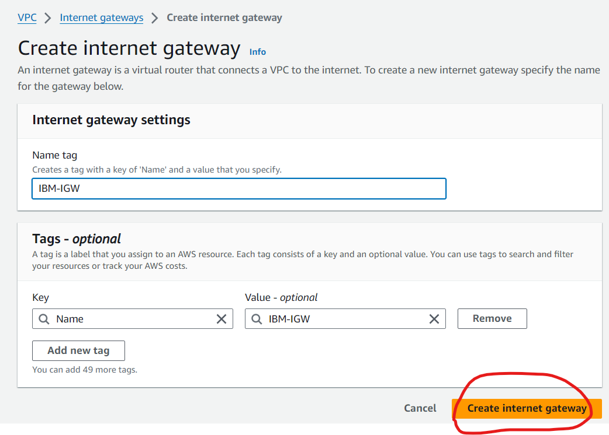

* Attach the VPC to the IGW.
  
  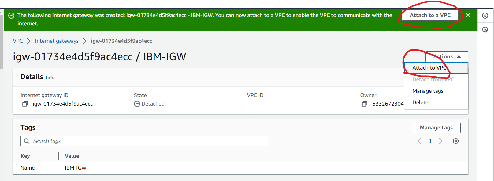
  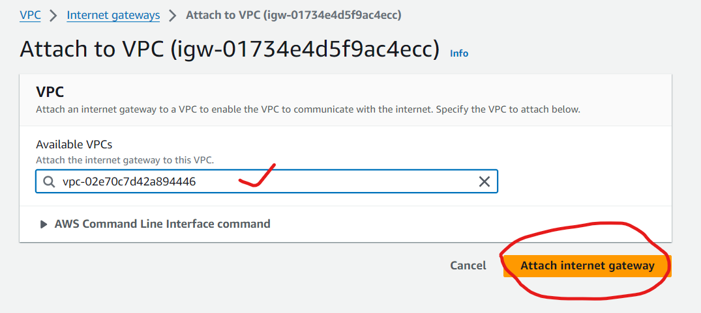

* To give internet access to the app subnet. GO to the APP-RT --> Route --> Add route.

  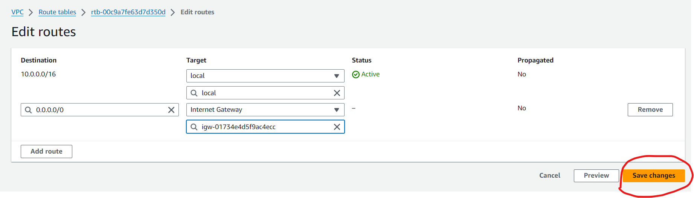
  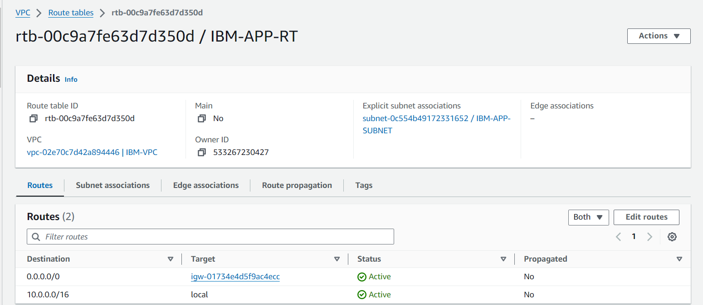
   

