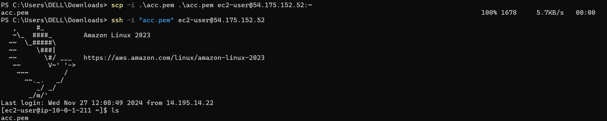
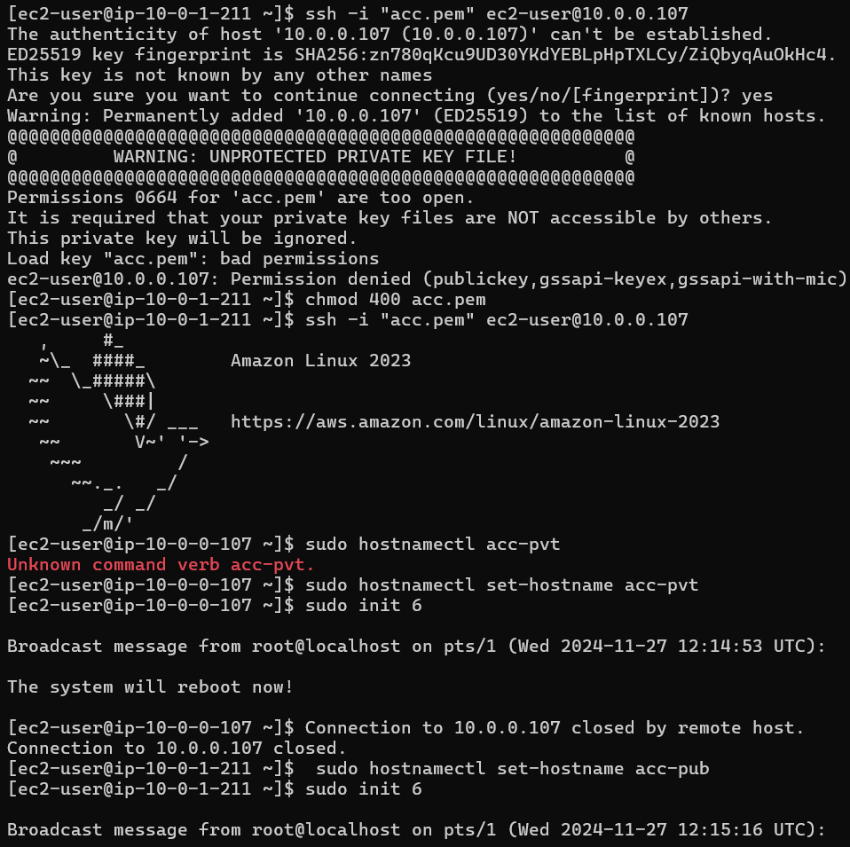
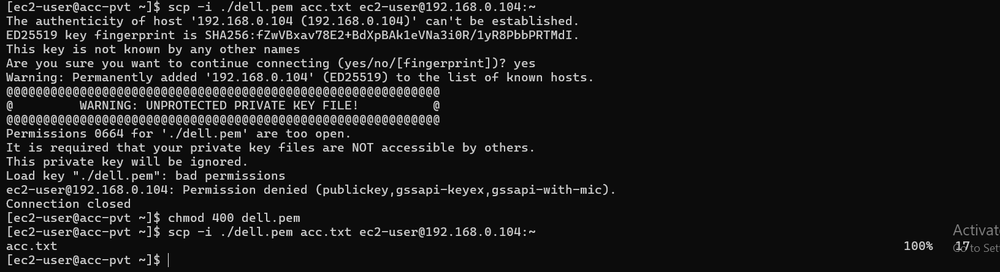

# VPC Peering Connection
* Imagine there are 2 VPC(DELL-VPC & ACC-VPC) both of them working for same client(Uber). Acc is managing customer details of client and DELL is managing customer details of client.
* In ACC-VPC, maintains a Database which contains customer details in Pvt-Subnet.
* In DELL-VPC, maintains a Database which contains payment details in Pvt-Subnet.
* If DELL needs to access to customer details and ACC needs payment details. They have to exchange information from one pvt server of one VPC to another pvt server of other VPC.
* To communicate with the Private server in one VPC we need a bastion host or jump server.
* **Bastion host** present in same network exposed to public network from there we can connect with pvt servers.

### Lab Setup
* Create 2 VPC.
  
  
  

* Now I will be launching 2 EC2 instances in those Pvt-Subnet that I have created earlier.


* In order to connect with pvt ec2s we need a bastion host in respective networks.
* For Bastion host, we have to launch ec2 instances in pub-subnets.
  


* From Public server to connect with private server we need pem file of private server to be be present in public server.
* Pem file is present in local server we have to send the pem file from local server to public server.
```bash
 #scp -i .\<pem file name> .\<file you want to transfer> <username>@<ip address>:~
 scp -i .\acc.pem .\acc.pem ec2-user@54.175.152.52:~ # for acc, :~ is to copy the file to home directory
 scp -i .\dell.pem .\dell.pem ec2-user@13.234.76.202:~
 ```
 
 
 

* pem file should not have read and write permission so I have changed the permission of pem file.
```bash
chmod 400 acc.pem
chmod 400 dell.pem
```
 
 
 

* In ACC-VPC, pvt-server have a file that file has to transfered to Dell-Pvt server.
  
  

* For this transfer the pemfile of DELL-pvt server to ACC-pvt server and then try to send the file you want to share.
  
  

* This is where `VPC peering` comes into picture.
  
 **_VPC Peering connection is a networking connection between 2 VPC that enables you to route the traffic between them. Instances in 2 VPCs can communicate with each other as if they are within the same network._**
  
* VPC peering is a 2 way connection, Peering is like friend request, once we send the VPC peering request then other VPC have to accept the request. These VPC CIDR should not collide with each other.

### Create a VPC peering
  
  
  
  
  
  

* Now try to send the file to dell-pvt server fro acc-pvt.
  
  

* Connection is not established because, After peering connection is done to send & receivce traffic across VPC peering connection, you must add a route to the peered VPC in route table.
  
  * In ACC-Pvt-RT,
  
  

  * In DELL-Pvt-RT,
  
  

* Now try to send the file.
  
  
  

* We can log into the dell-pvt server from acc-pvt server.
  
  

* We can do the same process from dell servers to.