# Cloud Formation
* Cloud Formation is used for building Infrastructure as a Code(IaC).
* Cloud Formation has stack. Stack is set of details you can want AWS to perform.
* AWS provide cloud formation [userguide](https://docs.aws.amazon.com/AWSCloudFormation/latest/UserGuide/template-formats.html).
* Cloud Formation can be written in two formates
    1. yaml
    2. json
* In stack we will give templateto create the resources. In background, templates will be stored in S3.
* We can see the overview in instructuture compose.

### Lets create a cloudformation template

* First we have to create the stack.

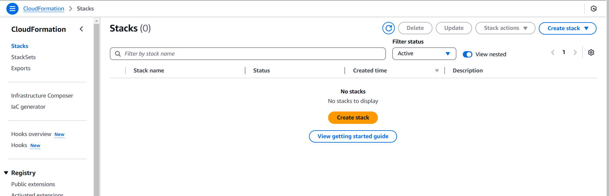
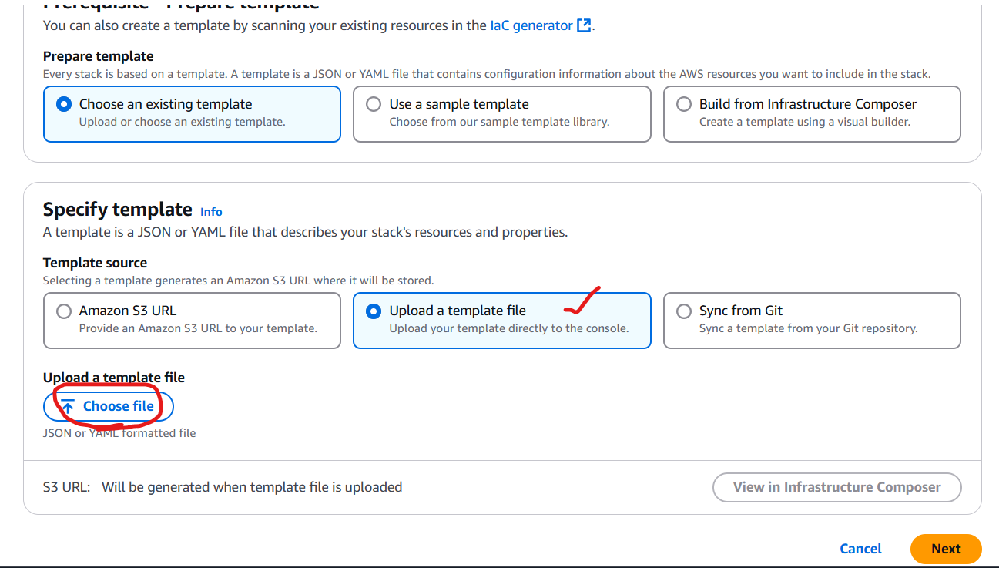
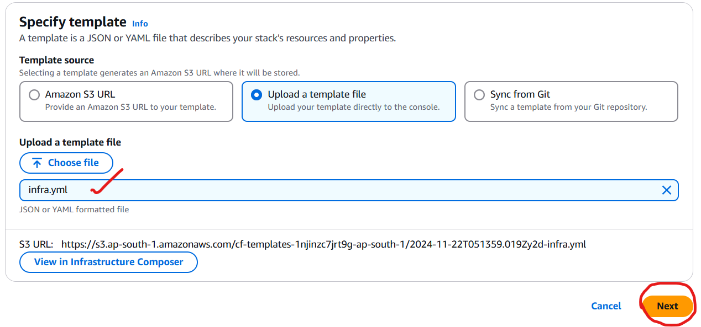

* We can see the resources which we are going to creating.
  
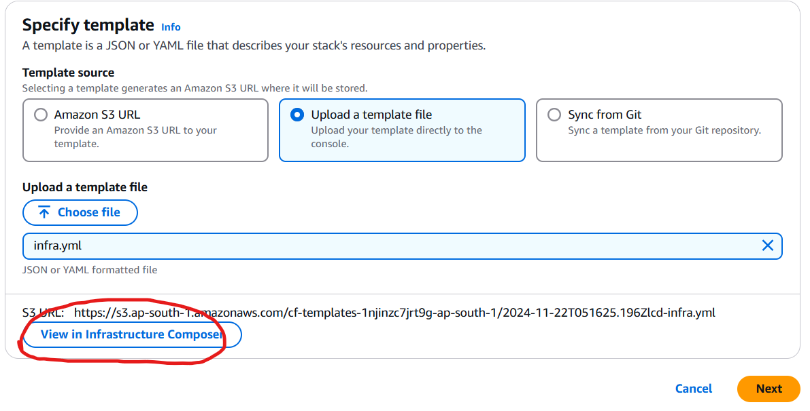
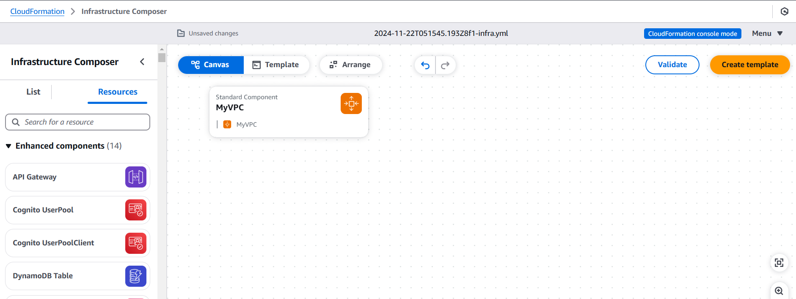
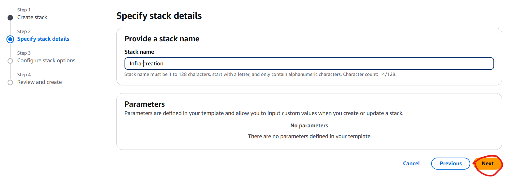
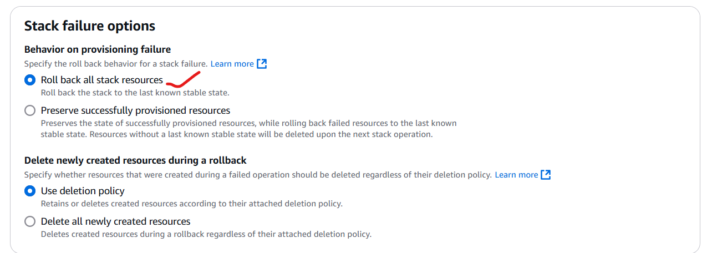
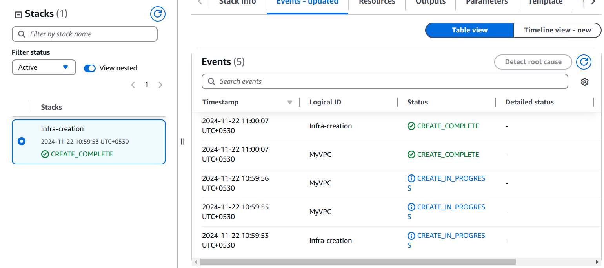
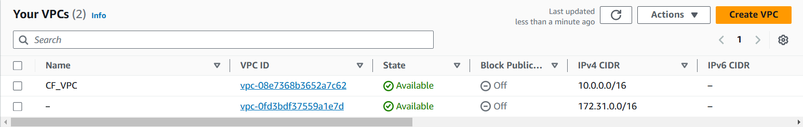

For cloudformation template to create VPC [refer here](https://github.com/AWS-DevOps-BasicS/Cloud-Computing/commit/ed70e9a17a291de4265c92a18421dde5edaabd3b)

* Now we will update our infrastucture to create internet gateway, subnets, route tables.
* Extended the template to create public subnet and private subnets. [template](https://github.com/AWS-DevOps-BasicS/Cloud-Computing/commit/836a097623ac4a29027e519dc066c39ae9f7d656)
  
* You can update the stack.
  
  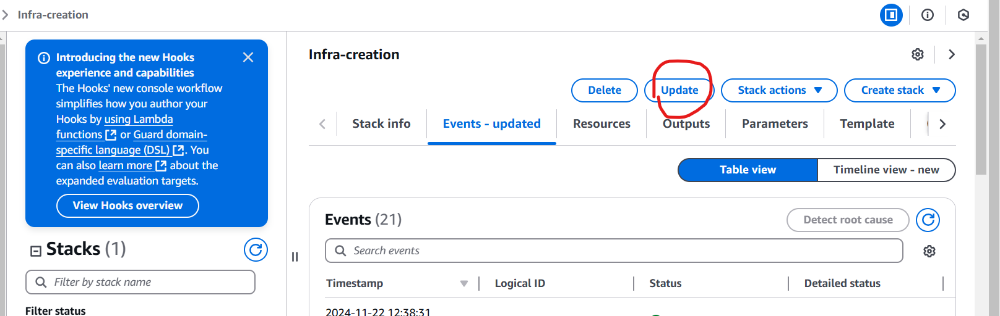
  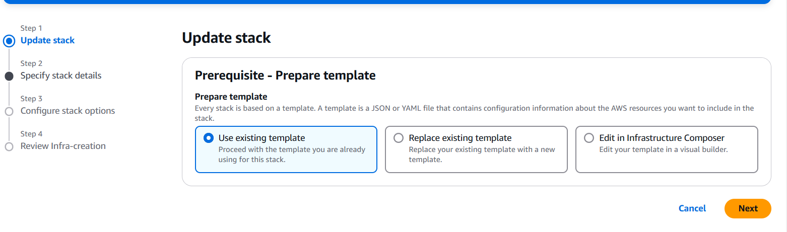
  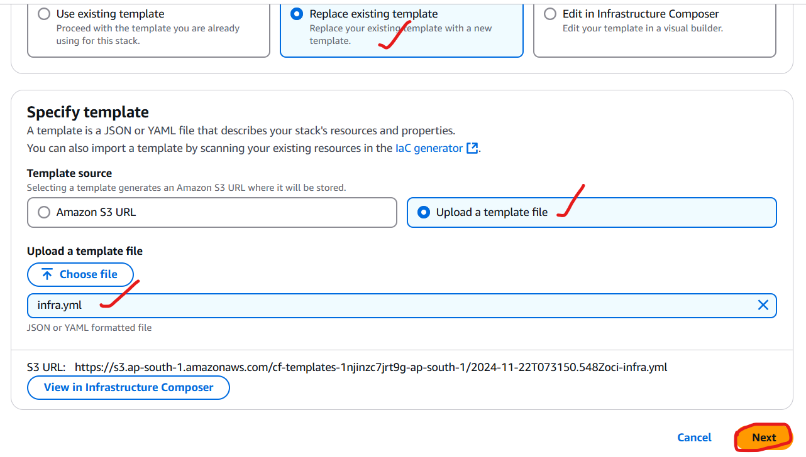

* Update the stack and check the resources are created or not.
  
  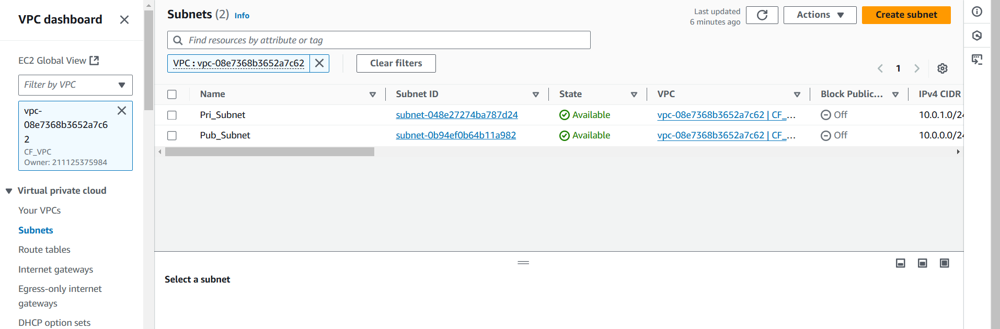

* Now create Internet gateway and attach the internet gateway to the vpc created.[Template](https://github.com/AWS-DevOps-BasicS/Cloud-Computing/commit/2cbd3f80b06bcd4ab5c16499864bde37599a3783)
  
* Check the resource is created or not.

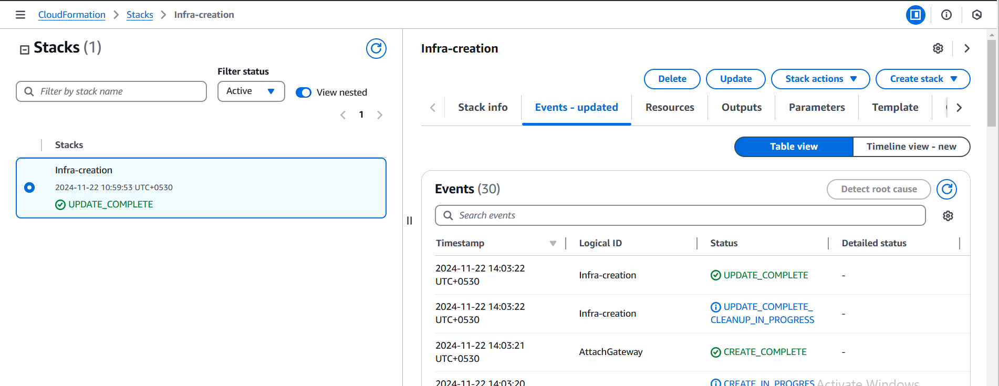
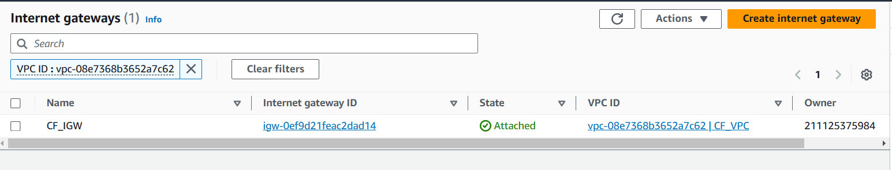

* Now lets create two route tables.[Template](https://github.com/AWS-DevOps-BasicS/Cloud-Computing/commit/6aa5e41edd21fdbd99e4349062bafe284f1d1d9a)

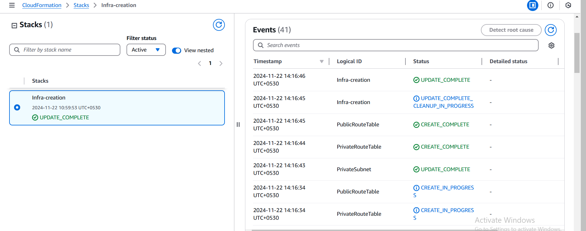
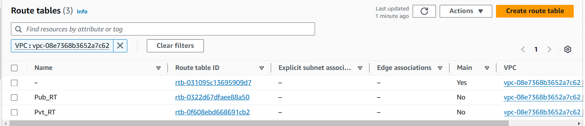

* Now associate subnets with Route tables respectively.[Template](https://github.com/AWS-DevOps-BasicS/Cloud-Computing/commit/af0fc617a8e2ae63c239d22c0d10e6c5a4754ff0)
  
  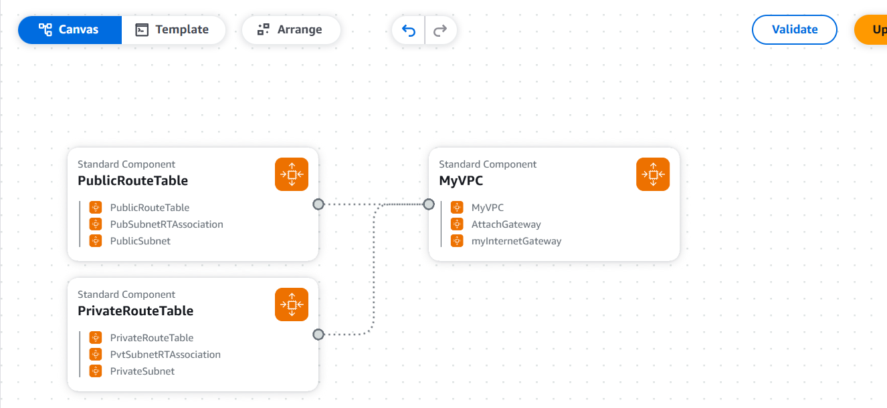
  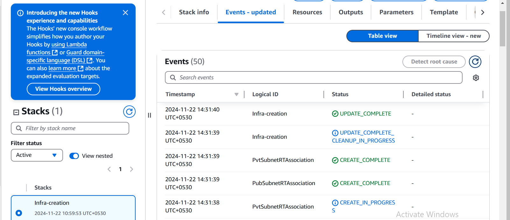
  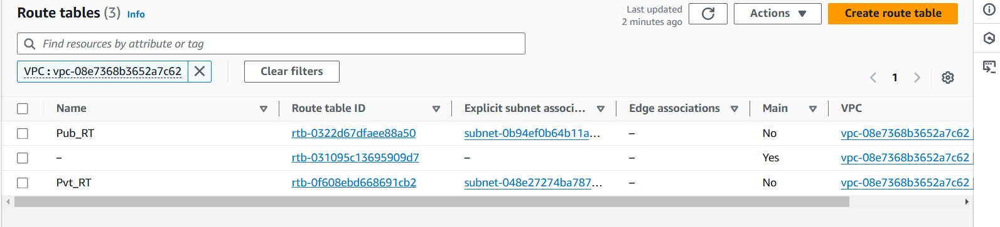

* Now add route to internet gateway in public routetable.[template](https://github.com/AWS-DevOps-BasicS/Cloud-Computing/commit/f963ef635c9553ce2649883052e8cd836d6e6e61)
  
  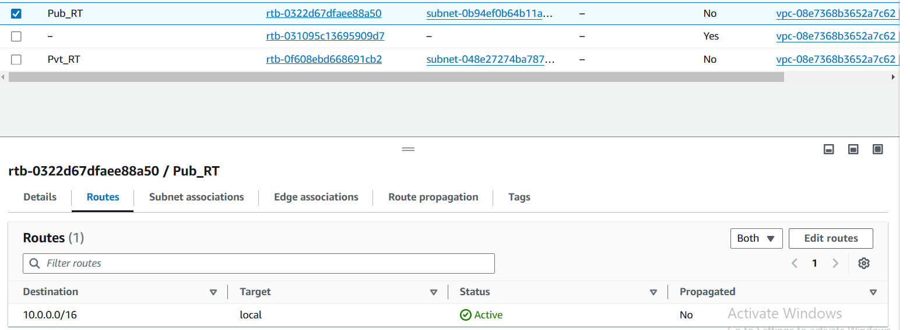
  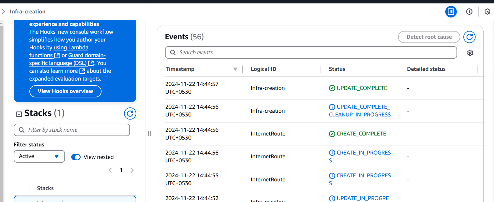
  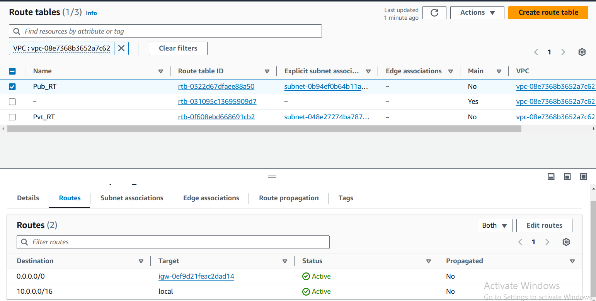

* Now create a security group.[template](https://github.com/AWS-DevOps-BasicS/Cloud-Computing/commit/3ed831b341624d8ea8fdf8b23d2c845d8d2a6258)
  
  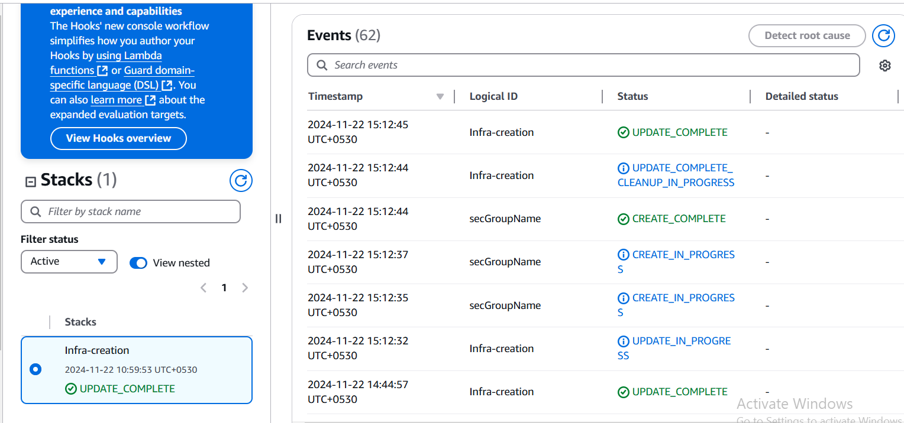
  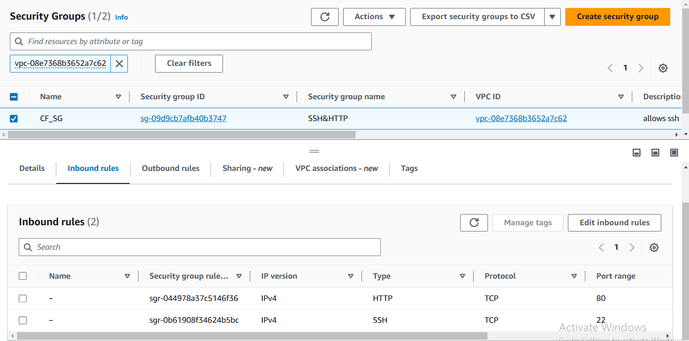

* Now create 2 instance one in public subnet and other in private subnet.[Template](https://github.com/AWS-DevOps-BasicS/Cloud-Computing/commit/65469dab806ca5f11c15fbd6137d018f873e3ee9)
  
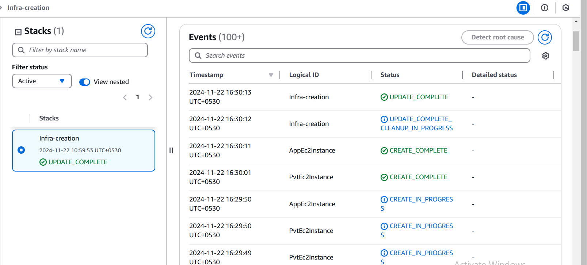
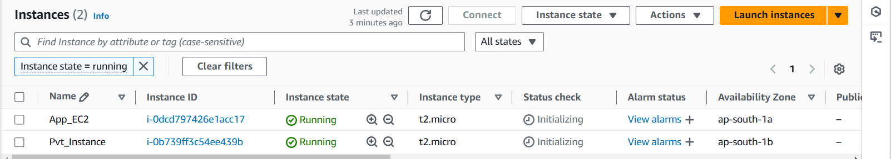


```yaml
AWSTemplateFormatVersion: 2010-09-09
Description: Creating Infrastructure for application
Resources:
  MyVPC: 
    Type: AWS::EC2::VPC
    Properties:
        CidrBlock: 10.0.0.0/16
        EnableDnsHostnames: 'true'
        EnableDnsSupport: 'true'
        InstanceTenancy: 'default'
        Tags: 
            - Key: Name
              Value: CF_VPC
  PublicSubnet:
    Type: AWS::EC2::Subnet
    Properties:
        VpcId: 
            Ref: MyVPC
        AvailabilityZone: ap-south-1a
        CidrBlock: 10.0.0.0/24
        Tags: 
            - Key: Name
              Value: Pub_Subnet
  PrivateSubnet:
    Type: AWS::EC2::Subnet
    Properties:
        VpcId: 
            Ref: MyVPC
        AvailabilityZone: ap-south-1b
        CidrBlock: 10.0.1.0/24
        Tags: 
            - Key: Name
              Value: Pvt_Subnet
  myInternetGateway:
    Type: AWS::EC2::InternetGateway
    Properties:
      Tags:
      - Key: Name
        Value: CF_IGW
  AttachGateway:
    Type: AWS::EC2::VPCGatewayAttachment
    Properties:
        VpcId:
            Ref: MyVPC
        InternetGatewayId:
            Ref: myInternetGateway
  PublicRouteTable:
    Type: AWS::EC2::RouteTable
    Properties:
        Tags: 
            - Key: Name
              Value: Pub_RT
        VpcId: 
            Ref: MyVPC
  PrivateRouteTable:
    Type: AWS::EC2::RouteTable
    Properties:
        Tags: 
            - Key: Name
              Value: Pvt_RT
        VpcId: 
            Ref: MyVPC
  PubSubnetRTAssociation:
    Type: AWS::EC2::SubnetRouteTableAssociation
    Properties:
        RouteTableId: 
            Ref: PublicRouteTable
        SubnetId: 
            Ref: PublicSubnet
  PvtSubnetRTAssociation:
    Type: AWS::EC2::SubnetRouteTableAssociation
    Properties:
        RouteTableId: 
            Ref: PrivateRouteTable
        SubnetId: 
            Ref: PrivateSubnet
  InternetRoute:
    Type: AWS::EC2::Route
    DependsOn: AttachGateway
    Properties:
        RouteTableId:
            Ref: PublicRouteTable
        DestinationCidrBlock: 0.0.0.0/0
        GatewayId:
            Ref: myInternetGateway
  secGroupName:
    Type: AWS::EC2::SecurityGroup
    Properties:
      GroupName: SSH&HTTP
      GroupDescription: allows ssh and http
      VpcId:
            Ref: MyVPC      
      SecurityGroupIngress:
        - IpProtocol: tcp
          FromPort: 22
          ToPort: 22
          CidrIp: 0.0.0.0/0 
        - IpProtocol: tcp
          FromPort: 80
          ToPort: 80
          CidrIp: 0.0.0.0/0         
      SecurityGroupEgress:
        - IpProtocol: -1
          FromPort: -1
          ToPort: -1
          CidrIp: 0.0.0.0/0 
      Tags:
        - Key: Name
          Value: CF_SG
  MyKeyPair:
    Type: AWS::EC2::KeyPair
    Properties:
        KeyFormat: pem
        KeyName: CF_KeyPair
        KeyType: rsa
        Tags: 
            - Key: Name
              Value: CF_Key
  AppEc2Instance: 
    Type: AWS::EC2::Instance
    Properties: 
        InstanceType: t2.micro
        ImageId: ami-0aebec83a182ea7ea 
        KeyName: 
          Ref: MyKeyPair
        Tags:
          - Key: Name
            Value: App_EC2
        SecurityGroupIds: 
          - Ref: secGroupName
        SubnetId: 
          Ref: PublicSubnet
  PvtEc2Instance: 
    Type: AWS::EC2::Instance
    Properties: 
        InstanceType: t2.micro
        ImageId: ami-0aebec83a182ea7ea
        KeyName: 
          Ref: MyKeyPair
        Tags:
          - Key: Name
            Value: Pvt_Instance
        SecurityGroupIds: 
          - Ref: secGroupName
        SubnetId: 
          Ref: PrivateSubnet
```