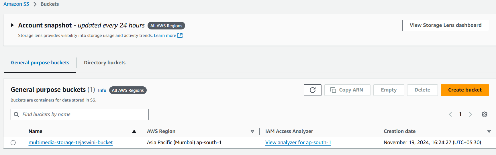
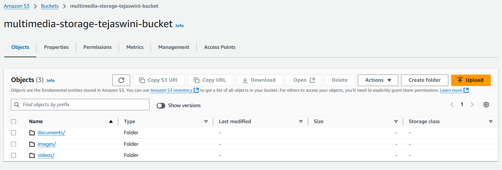
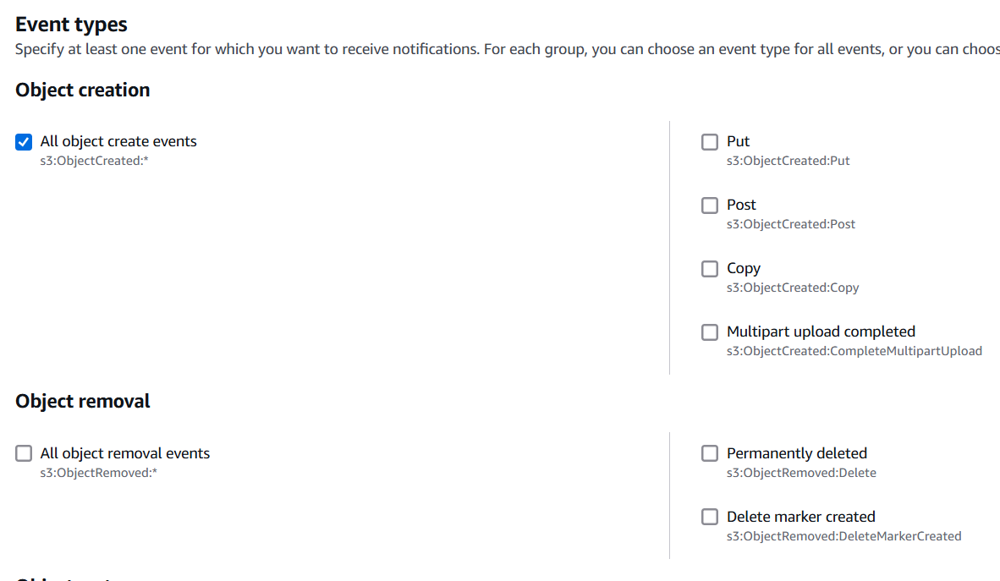

## Real-World Example

Imagine a scenario where a media company needs to store high-resolution images and video content. The images/ folder is used for frequently accessed images, while videos/ are archived after a certain period. Content must be stored securely, with only authorized users able to access and manage files, while older files are automatically archived for cost efficiency.

### Task Overview

Participants will create an S3-based solution to store, organize, manage, and archive multimedia content (e.g., images, videos, documents). They’ll learn to set up bucket configurations, use object versioning, implement lifecycle policies, and enforce security through bucket policies and access controls.

### Objectives

- Gain practical experience with **S3 bucket creation**, **object storage**, **versioning**, and **lifecycle policies**.
- Learn to secure data using **bucket policies**, **encryption**, and **access control lists (ACLs)**.
- Understand **cost optimization** through storage class transitions and lifecycle management.
- Use **S3 event notifications** to simulate file management automation.

### Step-by-Step Task Instructions

1. **Create an S3 Bucket with Appropriate Naming and Versioning**
    - Create a new S3 bucket named multimedia-storage-\[yourname\]-bucket.
   
      

    - Enable **bucket versioning** to manage file versions and track changes over time.
    - Upload a few files with the same name multiple times to test versioning. Observe how S3 maintains versions of each object.
      
      
        
      
2. **Organize Files Using Prefixes (Folders)**
    - Create a folder structure within the bucket. For instance:
        - images/
        - videos/
        - documents/

       

    - Upload several files into each "folder" and understand how prefixes work in S3 to simulate directory structures.
     
     
     
     
     
     
     
     
     
     
3. **Implement Lifecycle Policies for Cost Optimization**
    - Set up lifecycle policies for each folder to move objects to cost-effective storage classes over time:
        - Move objects in the images/ folder to **S3 Standard-IA** (Infrequent Access) after 30 days.
         
          
          
          
        - Move objects in the videos/ folder to **S3 Glacier** after 60 days and delete them after 180 days.
        - 
          
          
          
          

        - Experiment with different configurations for archiving data based on folder and file type.
    - Document each lifecycle policy created and explain why it’s optimized for cost and access patterns.
        - Cost Optimization:

            - Transitioning to S3 Standard-IA and S3 Glacier takes advantage of tiered pricing. Each transition is based on realistic access patterns, ensuring that we do not overpay for frequently accessed storage when objects are infrequently used.
            - Expiring old objects avoids accumulating unnecessary storage costs.
        - Access Patterns:

            - Logs are accessed more frequently in their first 30 days, so they remain in S3 Standard initially.
            - Older logs are less likely to be accessed, so transitioning to cheaper storage classes like Standard-IA and Glacier ensures availability at minimal cost.
            - Expired logs are deleted when they no longer serve any business purpose, reducing clutter and costs.
4. **Enable Server-Side Encryption**
    - Apply **server-side encryption** to the bucket to secure data at rest.
    - Use **S3 managed keys (SSE-S3)** or **AWS KMS keys (SSE-KMS)**.
    - Document the steps taken to enable encryption and the differences between SSE-S3 and SSE-KMS.

    
    
    
    
    - If we select AWS KMS we have to select KMS which we have created which stores passwords.
   
5. **Configure Access Controls and Bucket Policies**
    - Create a **bucket policy** that grants read access to a specific IAM role or user.
    - Add an **Access Control List (ACL)** to give specific permissions to selected users or groups.
    - Ensure that public access is blocked (unless specified) to prevent unintended exposure.
    - Review the policy and understand how permissions are defined and restricted.
  
    
6. **Set Up S3 Event Notifications for File Management Automation**
    - Configure the bucket to send **event notifications** on specific events, such as s3:ObjectCreated:\* or s3:ObjectRemoved:\*.
    - Route notifications to an Amazon SNS topic or email to simulate automation for file management.
    - Upload and delete files in the bucket, observing notifications for each action.
    - Create a SNS topic and add subcription to that topic.
  
  

    - After creating the SNS topic edit the Access policy like below.
  
  
```json
{
  "Version": "2012-10-17",
  "Statement": [
    {
      "Effect": "Allow",
      "Principal": {
        "Service": "s3.amazonaws.com"
      },
      "Action": "sns:Publish",
      "Resource": "arn:aws:sns:ap-south-1:211125375984:s3_objects",
      "Condition": {
        "ArnLike": {
          "aws:SourceArn": "arn:aws:s3:::multimedia-storage-tejaswinibokka-bucket"
        }
      }
    }
  ]
} 
```

  - Before setting for event notification we have to set bucket policy for SNS to access.
  


```json
{
    "Version": "2012-10-17",
    "Statement": [
        {
            "Effect": "Allow",
            "Principal": {
                "Service": "sns.amazonaws.com"
            },
            "Action": "s3:PutObject",
            "Resource": "arn:aws:s3:::multimedia-storage-tejaswinibokka-bucket/*"
        }
    ]
}
```
  
  
  
  

  - After creating the event now check the email you will get the test mail. 
  - Upload an object to the bucket and check the mail for notification.
  
  

7. **Implement Cross-Region Replication (Optional)**
    - Set up **Cross-Region Replication (CRR)** to duplicate data from your primary bucket to a secondary bucket in another AWS region.
    - Make sure versioning is enabled on both buckets and create IAM policies that permit replication.
    - Test the replication by uploading files to the primary bucket and verifying their presence in the secondary bucket.
  
  
  
  
  
  
  
  
  
  
  
  
  

* This is the policy inline provided by AWS.
```json
{
    "Version": "2012-10-17",
    "Statement": [
        {
            "Effect": "Allow",
            "Action": [
                "s3:InitiateReplication"
            ],
            "Resource": "arn:aws:s3:::tteokbokki-us-east-1/*"
        },
        {
            "Effect": "Allow",
            "Action": [
                "s3:GetObject",
                "s3:GetObjectVersion"
            ],
            "Resource": [
                "arn:aws:s3:::{{ManifestDestination}}/*"
            ]
        },
        {
            "Effect": "Allow",
            "Action": [
                "s3:PutObject"
            ],
            "Resource": [
                "arn:aws:s3:::tteokbokki-us-west-2/*"
            ]
        },
        {
            "Effect": "Allow",
            "Action": [
                "s3:GetReplicationConfiguration",
                "s3:PutInventoryConfiguration"
            ],
            "Resource": "arn:aws:s3:::tteokbokki-us-east-1"
        },
        {
            "Effect": "Allow",
            "Action": [
                "s3:PutObject"
            ],
            "Resource": "arn:aws:s3:::{{ManifestDestination}}/*"
        }
    ]
}
```


### Why Use a Bucket Policy When IAM Policies Already Grant Access?
* Use **IAM policies** for granting permissions to specific users, groups, or roles within your AWS account.
* Use **bucket policies** for:
    * Cross-account access.
    * Public access restrictions.
    * Global or bucket-wide rules.
  
### Cross-Account S3 Bucket Access Using IAM User


##### Scenario


*   **Account A**: Owns the S3 bucket (example-bucket).
  
  
    
*   **Account B**: Has the IAM user that needs access to the bucket in Account A.
    

#### 1\. Steps in Account B


**Create an IAM User**

1.  Log in to **Account B's AWS Management Console**.
    
2.  Go to **IAM** > **Users** > **Add users**.
    
3.  Enter the username, e.g., S3AccessUser.
    
4.  Select:
    
    *   **Access key - Programmatic access** (for CLI/SDK access).
        
    *   **AWS Management Console access** (if needed).
        
5.  Click **Next**.
    
    

**Attach Inline Policy to the User**

**IAM Policy for the User**

 ```json
{
  "Version": "2012-10-17",
  "Statement": [
    {
      "Effect": "Allow",
      "Action": [
        "s3:GetObject",
        "s3:ListBucket"
      ],
      "Resource": [
        "arn:aws:s3:::example-bucket",
        "arn:aws:s3:::example-bucket/*"
      ]
    }
  ]
}
```

1.  Attach this policy to the IAM user S3AccessUser.
    
2.  Replace example-bucket with the bucket name in Account A.
    
    

#### 2\. Steps in Account A


**Add a Bucket Policy to Grant Access**

**Bucket Policy**

```json
{
  "Version": "2012-10-17",
  "Statement": [
    {
      "Sid": "CrossAccountAccess",
      "Effect": "Allow",
      "Principal": {
        "AWS": "arn:aws:iam::AccountB-ID:user/S3AccessUser"
      },
      "Action": [
        "s3:GetObject",
        "s3:ListBucket"
      ],
      "Resource": [
        "arn:aws:s3:::example-bucket",
        "arn:aws:s3:::example-bucket/*"
      ]
    }
  ]
}
```
1.  Go to **S3 Console** in Account A.
    
2.  Open the bucket (example-bucket).
    
3.  Navigate to the **Permissions** tab.
    
4.  Add the above bucket policy under **Bucket Policy**.
    
5.  Replace:
    
    *   AccountB-ID with Account B's AWS account ID.
        
    *   S3AccessUser with the IAM user name in Account B.
        
    *   example-bucket with the bucket name in Account A.

        

#### 3\. Test Access


**Using AWS CLI**

**Step 1: Configure User Credentials**

`aws configure --profile cross-account-user`

*   **Access Key ID**: Enter the IAM user’s access key.
    
*   **Secret Access Key**: Enter the secret key.
    
*   **Default Region**: Enter the bucket's region (e.g., us-east-1).
    


**Step 2: Test Access**
```bash
aws s3 ls s3://example-bucket --profile cross-account-user
    
aws s3 cp s3://example-bucket/example-object.txt . --profile cross-account-user
```


