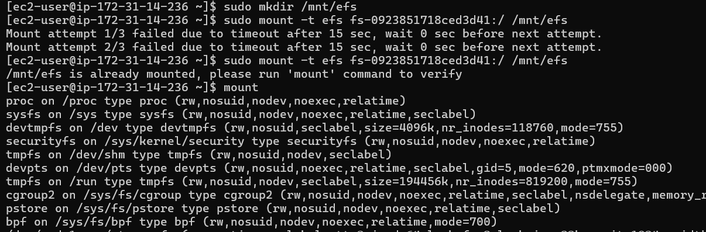
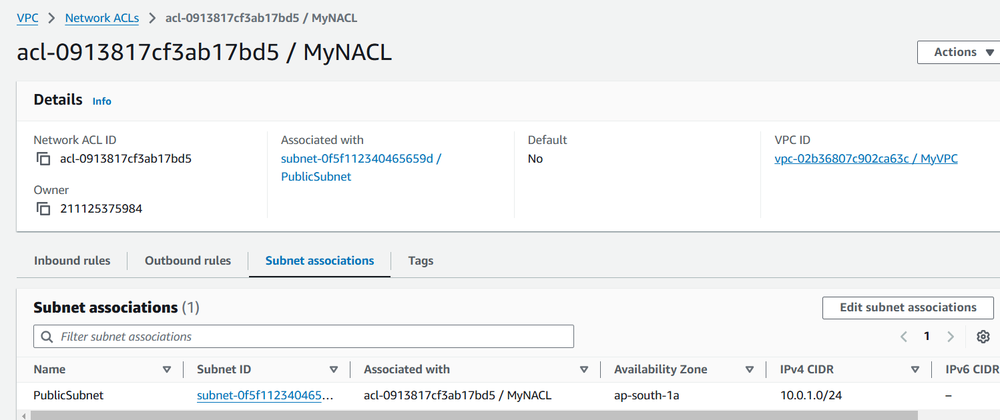
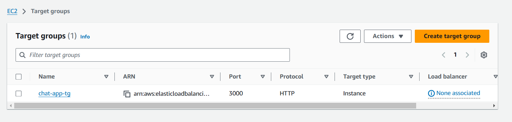

# Project Overview: Real-Time Chat Application Using AWS EC2 with EFS

**Prerequisites**
- An AWS account
- AWS CLI installed and configured
- Basic knowledge of Node.js and Express

## Step-by-Step Guide

### Step 1: Create an EFS File System

1. **Log in to the AWS Management Console** and navigate to the **EFS** service.

2. **Create a New File System:**
   - Click on "Create file system."
  
  

   - Choose the default settings, and make sure to create the file system in the same VPC where your EC2 instances will reside.
    
  
  
   - Note the **File System ID** for later use.
 
 
   
   - Edit the security group and add the security group which allows 2049 port.
  
  

3. **Configure Access Points (optional):** You can set access points for permissions and paths, but for simplicity, we’ll use the default settings.

### Step 2: Create and Launch EC2 Instances

1. **Navigate to the EC2 Dashboard** in the AWS Management Console.

2. **Launch EC2 Instances:**
   - Click on "Launch Instance."
   - Choose an Amazon Machine Image (AMI), such as **Amazon Linux 2**.
   - Select an instance type (e.g., `t2.micro` for the free tier).
   - Configure instance details, ensuring they are in the same VPC as your EFS.
   - **Add Storage:** Leave the default settings.
   - **Configure Security Group:**
     - Allow inbound traffic on port `22` (SSH) and port `3000` (for the chat application).
   - Review and launch the instance.




3. **Note the public DNS or IP address** of the instance for accessing the application later.

### Step 3: Mount EFS on the EC2 Instances

1. **SSH into Your EC2 Instance:**
```bash
ssh -i your-key.pem ec2-user@your-instance-public-dns
```

2. **Install the EFS Utilities:**
```bash
sudo yum install -y amazon-efs-utils
```

3. **Create a Mount Point:**
```bash
sudo mkdir /mnt/efs
```

4. **Mount the EFS File System:**
   - Replace `fs-XXXXXX` with your EFS File System ID.
```bash
sudo mount -t efs fs-XXXXXX:/ /mnt/efs
```



5. **Ensure EFS is Mounted on Reboot:**
   - Edit the fstab file:
```bash
echo "fs-XXXXXX:/ /mnt/efs efs defaults,_netdev 0 0" | sudo tee -a /etc/fstab
```


### Step 4: Set Up the Node.js Application

1. **Install Node.js and NPM:**
```bash
sudo yum install -y nodejs npm
```

2. **Create a New Directory for Your Project:**
```bash
sudo mkdir /mnt/efs/chat-app
cd /mnt/efs/chat-app
```

3. **Initialize a New Node.js Project:**
```bash
sudo npm init -y
```

4. **Install Required Packages:**
```bash
sudo npm install express ws body-parser
```

5. **Create the Server:**
   - Create a file named `server.js`:
```javascript
const express = require('express');
const WebSocket = require('ws');
const bodyParser = require('body-parser');
const fs = require('fs');
const path = require('path');

const app = express();
const server = require('http').createServer(app);
const wss = new WebSocket.Server({ server });

const DATA_FILE = '/mnt/efs/messages.txt'; // EFS file path

app.use(bodyParser.json());
app.use(express.static('public'));

app.get('/messages', (req, res) => {
    fs.readFile(DATA_FILE, 'utf8', (err, data) => {
        if (err) return res.status(500).send('Error reading messages');
        res.send(data);
    });
});

wss.on('connection', (ws) => {
    console.log('New client connected');

    ws.on('message', (message) => {
        console.log(`Received: ${message}`);
        fs.appendFile(DATA_FILE, message + '\n', (err) => {
            if (err) console.error('Error saving message:', err);
        });

        // Broadcast the message to all connected clients
        wss.clients.forEach((client) => {
            if (client.readyState === WebSocket.OPEN) {
                client.send(message);
            }
        });
    });

    ws.on('close', () => {
        console.log('Client disconnected');
    });
});

const PORT = process.env.PORT || 3000;
server.listen(PORT, () => {
    console.log(`Server is running on port ${PORT}`);
});
```

6. **Create a Simple HTML Client:**
   - Create a directory named `public`, and inside it create an `index.html` file:
```html
<!DOCTYPE html>
<html>
<head>
    <title>Real-Time Chat</title>
    <style>
        body { font-family: Arial, sans-serif; }
        #messages { border: 1px solid #ccc; height: 300px; overflow-y: scroll; }
    </style>
</head>
<body>
    <h1>Chat Room</h1>
    <div id="messages"></div>
    <input type="text" id="message" placeholder="Type a message..." />
    <button id="send">Send</button>

    <script>
        const ws = new WebSocket('ws://' + window.location.host);
        const messagesDiv = document.getElementById('messages');
        const messageInput = document.getElementById('message');

        ws.onmessage = function(event) {
            const message = document.createElement('div');
            message.textContent = event.data;
            messagesDiv.appendChild(message);
        };

        document.getElementById('send').onclick = function() {
            const message = messageInput.value;
            ws.send(message);
            messageInput.value = '';
        };
    </script>
</body>
</html>
```
### Step 5: Run Your Application

1. **Start the Server:**
```bash
node server.js
```

2. **Access Your Application:**
   - Open a web browser and navigate to `http://your-instance-public-dns:3000`.


### Step 6: (Optional) Setup Auto Scaling

If you want to deploy this application across multiple EC2 instances, you can set up an **Auto Scaling Group** and a **Load Balancer** through the EC2 console or using CloudFormation.
1. **Create a target group**
   - Navigate to EC2 → Target Groups.
   - **Type:** Choose "Instances" (or "IP addresses" if using containerized apps or private IPs).
   - **Protocol:** Select `HTTP`.
   - **Port:** Set it to `3000`.
   - **VPC:** Choose the appropriate VPC where your application instances are located.

2. **Create the load balancer** 
   - **Navigate to Load Balancers in the EC2 console:**

        * Click Create **Load Balancer** → Choose **Application Load Balancer**.
   - **Configure the ALB:**

        * **Name:** Provide a name (e.g., my-app-alb).
        * **Scheme:** Choose "internet-facing" for public access or "internal" for private access.
        * **IP address type:** IPv4 (if your VPC doesn't support IPv6).
        * **Listeners:** Add a listener for port `3000`, with the protocol set to HTTP.
   - **Availability Zones:**

        * Select the VPC and at least two subnets in different availability zones.
    - **Security group:**

        * Create or select a security group that allows incoming traffic on port 3000 from the desired sources (e.g., 0.0.0.0/0 for all).
        * 


3. **Prepare a Launch Template or Launch Configuration**
   - **Navigate to EC2 Console:**

        * Go to EC2 > Launch Templates > Click Create Launch Template.
   - **Configure the Launch Template:**

        * **Name:** Give it a name (e.g., my-app-launch-template).
        * **AMI ID:** Choose an AMI that contains your application or its dependencies.
        * **Instance Type:** Select the instance type (e.g., t2.micro).
        * **Key Pair:** Add a key pair to access the instances (if needed).
        * **Security Group:** Attach a security group that allows:
            - Inbound traffic on port 3000 from the ALB's security group.
            - Outbound traffic to the internet for updates.
   - Add **User Data**
       * In userdata mention the command we have to run for mounting EFS and running the nodejs application
```bash
#! /bin/bash
sudo yum install -y amazon-efs-utils
sudo mkdir /mnt/efs
sudo mount -t efs fs-0923851718ced3d41:/ /mnt/efs
echo "fs-0923851718ced3d41:/ /mnt/efs efs defaults,_netdev 0 0" | sudo tee -a /etc/fstab
sudo yum install -y nodejs npm
cd /mnt/efs/chat-app && sudo node server.js
```


    - Save the launch template.
4. **Create an Auto Scaling Group**
   - **Navigate to EC2 Console:**

        * Go to EC2 > Auto Scaling Groups > Click Create Auto Scaling Group.
   - **Configure the ASG:**

        * Name: Provide a name (e.g., my-app-asg).
        * Launch Template: Select the launch template you created earlier.
   - Choose the VPC and Subnets:

        * Select the same VPC and subnets used for your Load Balancer.
   - Attach to Load Balancer:

        * Select Attach to a Load Balancer.
        * Choose the Application Load Balancer created earlier.
        * Select the Target Group associated with the ALB.
   - Set Desired, Minimum, and Maximum Capacity:

        * Desired Capacity: 2 (e.g., 2 instances running at all times).
        * Minimum Capacity: 1.
        * Maximum Capacity: 5.
   - Health Checks:

        * Choose ELB Health Check for better scaling accuracy.
   - Review and Create
        * Review all the settings and click Create Auto Scaling Group.
  


5. **Test the Setup**
- Access the Load Balancer's DNS name in a browser.
- Confirm the application is accessible and scaling works as expected 
  
  
  
### Step 7: Cleanup

When you are done with your project, remember to terminate your EC2 instances and delete the EFS to avoid unnecessary charges.