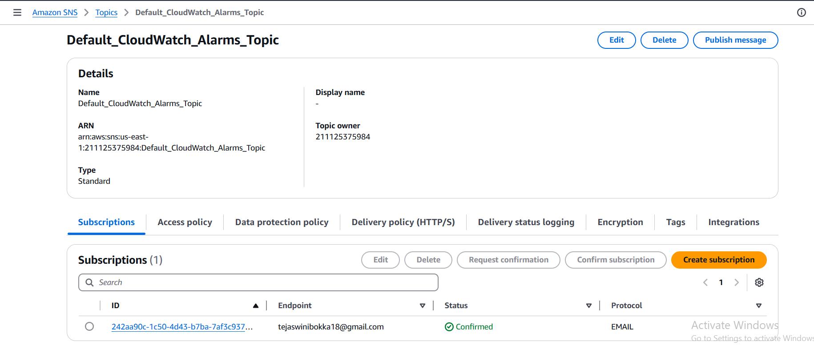

### Requirement 

1. **VPC and Subnet Configuration:**

    * Create a VPC with a /16 CIDR range.
    * Attach an Internet Gateway (IGW) to the VPC.
    * Create four subnets:
        * **1 Public Subnet** with 4,096 IPs.
        * **3 Private Subnets** with 256 IPs each.
2. **Compute Resources:**

    * Create 3 servers, each in a different private subnet, for running the application.
    * Deploy the Python application available at: https://github.com/AWS-DevOps-BasicS/Job_Application.git
3. **Database:**

    * Create a MySQL database using RDS, configured as private and accessible only to administrators.
    * Integrate the RDS database with the deployed application across all EC2 instances.
4. **Accessibility:**

    * Host the application on private resources, but ensure public access via a custom domain using Route 53.
    * Traffic should be routed via a load balancer.
5. **Scalability and Reliability:**

    * Configure a load balancer to distribute traffic across the private EC2 instances.
    * Enable auto-scaling to maintain fault tolerance (FT).
6. **Monitoring and Notifications:**

    * Set up monitoring and notifications for infrastructure resources.
  
7. **CDN Functionality:**

    * Users accessing the CDN should reach the application, where user information is collected and stored in the database.


### Process
**1. VPC and Subnet Setup**
  * Created a VPC with CIDR range 192.168.0.0/16.

  * Added an Internet Gateway and set up necessary routing components.

  * Configured one public subnet and three private subnets based on the requirements.
  
  

**2. EC2 Instances and RDS Configuration**
* Deployed 3 EC2 instances across the private subnets and 1 in the public subnet for administrative access.


* Created a MySQL RDS instance for the application..
  
  

**3. Accessing Private Servers**

To access private EC2 instances from the public EC2 instance:

1. Copy the private EC2 PEM key to the public EC2 instance
```shell
scp -i <path/of/publicserver_pemkey> <path/of/privateserver_pemkey> ec2-user@<public_server_ip>:~
```
1. Log in to the public EC2 instance:
```bash
ssh -i <pem_key> ec2-user@<public_ip>
chmod 400 ./<private_pem_key> 
ssh -i <private_pem_key> ec2-user@<private_ip>
```
**4. Deploying the Application**
  1. Create a NAT Gateway to provide internet access for private servers to install necessary packages.
  2. On each private EC2 instance
```bash
sudo yum install pip git python -y
git clone https://github.com/AWS-DevOps-BasicS/Job_Application.git
cd job_application
pip install -r requirements.txt
```
  1. Follow the repository instructions to configure the application to use RDS.
  2. Verify the application:
   
```bash
curl localhost:5000
```


  5. To simplify deployment, create an AMI from the first private EC2 instance and use it to launch the other two private EC2 instances.
  
  

**5. Load Balancer Configuration**
* Create a Target Group for the 3 private EC2 instances for 5000 port
* Create an Application Load Balancer (ALB):

    * Use the public subnet for external access.
    * Set the ALB as internet-facing.
  
  
  
  

* Copy the ALB DNS and test application accessibility in the browser.


**6. Auto Scaling Setup**
1. Create a Launch Template using the configured private EC2 instance.

2. Configured an Auto Scaling Group (ASG) with CloudWatch metrics for dynamic scaling.

    * Define scaling policies for fault tolerance.




### Outcome
The infrastructure is fully functional with:

* A secure private database accessible only by admins.
* Fault-tolerant application hosting with auto-scaling and monitoring.
* External access to the application via a public-facing load balancer.
* Deployment of the Python application across private EC2 instances.
* Seamless integration of the application with an RDS MySQL database.